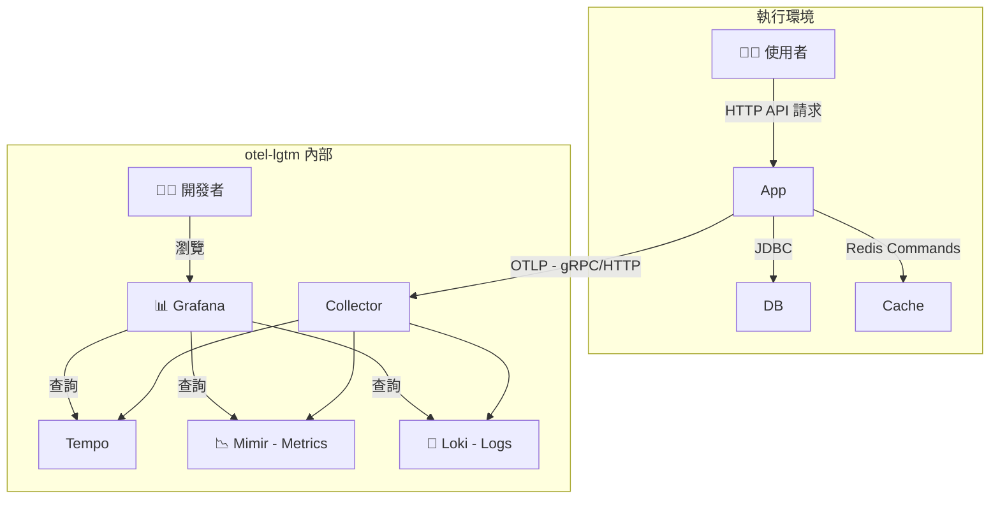
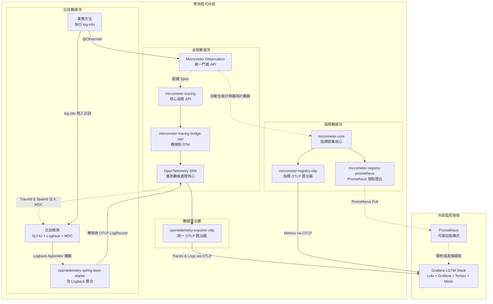

<a href="https://studio.firebase.google.com/import?url=https%3A%2F%2Fgithub.com%2Fsamzhu%2Fdemo-springboot-250613">
  
</a>

# Spring Boot 3 現代化專案實戰手冊

## 專案簡介

這份手冊將帶你了解一個使用 Java 21、Spring Boot 3 和 Gradle 建構的專案。我們的目標不只是寫出能動的程式，更要確保專案夠強壯、跑得快，而且未來容易維護。  

我們會從專案的基礎設定開始，一步步介紹資料庫 JPA、版本控制 Liquibase、快取 Redis 的用法。接著，我們會把重點放在「可觀測性」，學習如何用 Micrometer 和 OpenTelemetry (OTLP) 監控應用程式的健康狀況，並將所有監控數據送到 Grafana 平台進行分析。  

這份手冊適合要學習 Spring Boot 3 現代化作法的開發人員。  

---

## 軟體分層架構

專案的運作方式，可以用下面這張圖來理解：


- **WebController**: 接收使用者操作，例如點擊網頁按鈕。
- **AppService**: 處理主要的業務邏輯，是整個系統的核心。
- **Repository / CacheService**: 負責跟資料庫 (PostgreSQL) 和快取 (Redis) 打交道，存取資料。
- **DomainModel**: 定義了系統中的物件，例如一本書該有哪些屬性。

---

## 📁 專案結構概覽

這個專案採用了常見的分層架構。把不同功能的程式碼放在不同的資料夾，就像把衣服、褲子、襪子分類放好一樣，未來要找東西或修改會方便很多。

```text
.
├── build.gradle                # Gradle 建置腳本，定義專案需要哪些工具和套件
├── config/                     # 存放不同環境的設定檔，這些檔案不會被打包到最終的程式裡
│   ├── application-local.yml   # "local" 環境 (自己電腦) 專用的設定檔
│   ├── application-ut.yml      # "ut" 環境 (單元測試) 專用的設定檔
│   ├── application-sit.yml     # "sit" 環境 (整合測試) 專用的設定檔
│   └── application-prod-example.yml # "prod" 環境 (正式上線) 的設定檔範本 (重要密碼會存在別的地方)
├── compose.yaml                # Docker 設定檔，按一個鍵就能在本機架起所有需要的服務 (資料庫、Redis等)
├── dev-resources/
│   └── openapi.yaml            # API 規格檔案 (所有 API 設計的唯一標準)
└── src/
    ├── main/
    │   ├── java/com/example/demo/
    │   │   ├── applications/        # 應用層 (Service): 存放核心商業邏輯的地方
    │   │   ├── config/              # 設定層: 存放 Spring 需要的各種設定
    │   │   ├── infrastructure/      # 基礎設施層: 定義如何跟資料庫溝通的介面
    │   │   ├── interfaces/          # 介面層: 所有跟外部系統互動的程式碼都放這裡
    │   │   │   ├── api/             # - (自動產生) 根據 openapi.yaml 產生的 API 介面
    │   │   │   ├── dto/             # - (自動產生) 根據 openapi.yaml 產生的資料傳輸物件
    │   │   │   ├── mapper/          # - DTO 和資料庫 Entity 之間的轉換工具
    │   │   │   └── rest/            # - API 的具體實作程式碼 (Controller)
    │   │   ├── models/              # 模型層: 定義資料庫表格長相的程式碼 (JPA Entity)
    │   │   └── DemoApplication.java # Spring Boot 專案的啟動入口
    │   └── resources/
    │       ├── application.yml      # 最基礎、通用的 Spring Boot 設定檔
    │       ├── application-gcp.yml  # 給 Google Cloud Platform (GCP) 環境用的設定檔
    │       ├── application-aws.yml  # 給 Amazon Web Services (AWS) 環境用的設定檔
    │       └── db/changelog/        # Liquibase 資料庫變更腳本
    │           ├── db.changelog-master.yaml # 主要的變更紀錄檔
    │           └── history/         # 存放所有歷史變更紀錄
    └── test/                        # 測試程式碼
        └── java/com/example/demo/
            ├── TestDemoApplication.java
            ├── TestcontainersConfiguration.java # Testcontainers (一種測試工具) 的設定
            └── DemoApplicationTests.java        # 整合測試
```

---

## 🧩 核心技術與關鍵套件一覽

這個專案使用了一系列在業界廣泛應用的技術來打造。

### 語言/框架

- Java 21, Spring Boot 3.5.0

### 建置與工具外掛 (Plugins)

這些是幫助我們建置和管理專案的工具。

- **`org.springframework.boot`** Spring Boot 的核心工具。它讓我們能輕鬆啟動專案，並將整個專案打包成一個可以獨立運行的檔案。
- **`io.spring.dependency-management`** Spring 的依賴管理工具。它幫我們統一管理專案中用到的各種套件版本，我們就不需要手動指定每個套件的版本號了。
- **`org.openapi.generator`** 實踐「API First」的核心工具。它會讀取 `openapi.yaml` 這個規格檔，自動幫我們產生 API 的 Java 介面和資料模型(DTO)，確保程式碼和 API 文件永遠同步。
- **`com.gorylenko.gradle-git-properties`** 這個工具會產生一個 `git.properties` 檔案，裡面記錄了當前程式碼的 Git 版本資訊 (例如是哪個分支、哪次 commit)。這樣我們就能清楚知道線上運行的程式，到底是哪一個版本。
- **`org.cyclonedx.bom`** 軟體物料清單 (SBOM) 產生器。它會掃描專案，列出一張詳細清單，說明專案用到了哪些第三方套件。這對於檢查已知的安全漏洞和軟體授權合規性非常重要。
- **`jacoco`** 計算程式碼測試覆蓋率的工具。它能產生報告，讓我們知道測試寫得夠不夠完整。

### 關鍵依賴 (Dependencies)

這些是專案執行時需要的核心套件。

#### API 與 Web 層

- **`spring-boot-starter-web`** 開發 RESTful API 的必備套件。它包含了內嵌的伺服器 (Tomcat) 和 Spring MVC 框架。
- **`spring-boot-starter-validation`** 資料驗證工具。它讓我們可以在 DTO 上用 `@NotNull`, `@Size` 這樣的標籤，來設定資料規則。當 API 收到請求時，Spring 會自動檢查傳入的資料是否合法。
- **`springdoc-openapi-starter-webmvc-ui`** 自動產生一個互動式的 API 文件網頁 (Swagger UI)。這個網頁會根據我們的程式碼和 API 規格，讓我們能直接在瀏覽器上測試 API。
- **`mapstruct`** 和 **`mapstruct-processor`** 一個物件轉換工具。它能自動產生 DTO 和資料庫 Entity 互轉的程式碼，避免我們手寫大量重複的 get/set 程式。
- **`jackson-databind-nullable`** 一個輔助套件，用來解決 JSON 資料中 `null` 和「未提供 (undefined)」的區別。這在處理部分更新 (PATCH) 的情境下特別有用，可以讓我們精確判斷：使用者是故意要把某個欄位設成 `null`，還是他根本沒打算動那個欄位。

#### 資料存取與快取層

- **`spring-boot-starter-data-jpa`** 簡化資料庫操作的工具。它讓我們用簡單的方式就能完成對資料庫的新增、讀取、更新和刪除 (CRUD)。
- **`liquibase-core`** 資料庫版本控制工具。它讓我們能用檔案來管理資料庫結構的變化，就像用 Git 管理程式碼一樣，確保每個開發環境的資料庫結構都一致。
- **`spring-boot-starter-cache`** 提供了一套標準的快取 API。我們可以用 `@Cacheable` 這樣的標籤輕鬆地為程式加上快取功能，而不用去管底層是用哪種快取技術。
- **`spring-boot-starter-data-redis`** 整合 Redis 的套件。當它和 `spring-boot-starter-cache` 一起用時，Spring Boot 就會自動把 Redis 當作我們的快取儲存庫。

#### 可觀測性 (Observability) 層

- **`spring-boot-starter-actuator`** 可觀測性的基礎。它提供了一系列用於監控和管理應用程式的端點，例如檢查健康狀況的 `/actuator/health`。
- **`spring-boot-starter-aop`** 啟用 `@Observed` 註解的關鍵。它提供了一種叫做「面向切面編程 (AOP)」的技術，讓監控工具可以在我們指定的程式碼前後，自動加上紀錄指標和追蹤的邏輯。
- **`io.micrometer:micrometer-tracing-bridge-otel`** 一個橋接器。它的作用是把 Micrometer 的追蹤指令，翻譯成 OpenTelemetry 這個監控標準能聽得懂的格式。
- **`io.opentelemetry:opentelemetry-exporter-otlp`** 一個匯出器。它負責把追蹤 (Traces) 和日誌 (Logs) 數據，打包成 OTLP 這種標準格式，然後傳送到後端的監控系統。
- **`io.opentelemetry.instrumentation:opentelemetry-spring-boot-starter`** OpenTelemetry 的自動設定工具。它簡化了整合的複雜度，能自動把 OTel 的功能（例如傳送日誌）整合進 Spring Boot 專案中。
- **`io.micrometer:micrometer-registry-otlp`** 指標匯出器。它負責把 Micrometer 收集到的各種指標 (Metrics)，轉換成 OTLP 格式並傳送出去。
- **`io.micrometer:micrometer-registry-prometheus`** Prometheus 指標端點。它提供另一種查看指標的方式，會在 `/actuator/prometheus` 這個網址上，產生一個給 Prometheus 系統讀取的指標頁面。這在自己電腦上開發時特別好用。

---

## 🛠️ 開發與設定

### 開發指南

- 當 `openapi.yaml` 檔案有變動時，需要手動執行 `./gradlew clean openApiGenerate` 指令，來重新產生 API 相關的程式碼。
- 使用 `./gradlew bootRun --args='--spring.profiles.active=local'` 指令，可以用 `local` 設定檔來啟動專案。
- 在本機開發時，可以到 `http://localhost:8080/swagger-ui.html` 查看和測試 API。

### VSCode 設定

#### 建立 launch.json

你可以手動在專案底下建立一個 `.vscode/launch.json` 檔案。這個檔案的功能是讓你在 VSCode 裡點擊「執行」按鈕時，可以自動帶上特定設定。

例如，下面的設定檔可以讓我們在啟動應用程式時，自動使用 `local-env` 跟 `local` 這兩個環境設定，讓程式去讀取 `application-local.yml` 的內容。

```json
{
    "version": "0.2.0",
    "configurations": [
        {
            "type": "java",
            "name": "Current File",
            "request": "launch",
            "mainClass": "${file}"
        },
        {
            "type": "java",
            "name": "DemoApplication",
            "request": "launch",
            "mainClass": "com.example.demo.DemoApplication",
            "projectName": "demo-springboot-250613",
            "env": {
                "spring.profiles.active": "local-env,local" // ✨ 先載入 local-env 再載入 local 設定檔
            }
        },
        {
            "type": "java",
            "name": "TestDemoApplication",
            "request": "launch",
            "mainClass": "com.example.demo.TestDemoApplication",
            "projectName": "demo-springboot-250613"
        }
    ]
}
```

---

## 🤝 API First 開發流程

這個專案採用 **API First** 開發模式。簡單來說，就是「先定義好 API 規格，再開始寫程式」。

我們會先把 API 的所有細節（像是路徑、參數、回傳格式）都寫在 `openapi.yaml` 這個檔案裡。這份檔案就是我們唯一的、最終的標準，稱為**「單一事實來源 (Single Source of Truth)」**。這樣可以確保 API 文件和實際程式碼永遠保持一致。

### 運作方式

我們透過 `org.openapi.generator` 這個 Gradle 工具來實現自動化。當你編譯專案時，它會做幾件事：

1. **讀取規格**：讀取 `dev-resources/openapi.yaml` 檔案的內容。
2. **產生程式碼**：根據規格，自動產生對應的 Java 介面 (Interface) 和資料傳輸物件 (DTO)。
3. **納入編譯**：專案會把這些自動產生的程式碼當作原始碼的一部分。
4. **開發者實作**：開發人員只需要專心寫商業邏輯，去實作 (implement) 這些自動產生的介面。

### build.gradle 中的關鍵設定

來看看 `openApiGenerate` 這個任務的詳細設定：

```groovy
tasks.named('openApiGenerate') {
    generatorName.set("spring")
    library.set("spring-cloud")
    inputSpec.set(layout.projectDirectory.file("dev-resources/openapi.yaml").asFile.path) // API 規格檔在哪
    outputDir.set(layout.buildDirectory.dir("generated/openapi").get().asFile.path)      // 產生的程式碼要放哪
    apiPackage.set("com.example.demo.interfaces.api")   // 產生的 API 介面要放在哪個 package
    modelPackage.set("com.example.demo.interfaces.dto") // 產生的 DTO 模型要放在哪個 package
    configOptions.set([
        hateoas: "false",
        interfaceOnly: "true",        // ✨ 只產生介面，不產生實作類
        useResponseEntity: "true",    // ✨ API 回應時使用 Spring 的 ResponseEntity<T>
        useSpringBoot3: "true",       // ✨ 確保產生的程式碼相容 Spring Boot 3
        useTags: "true",              // ✨ 根據 YAML 中的 "tags" 屬性來分組 API
        unhandledException: "true"    // ✨ 強制開發者處理所有可能的錯誤
    ])
}
```

**重要參數解析：**

- `interfaceOnly: "true"`
  - **作用**：只產生 Java 的 `interface` (介面)，不會產生實際的 `Controller` 實作類別。
  - **好處**：讓開發者可以保有彈性，自由地去實作背後的商業邏輯。

- `useSpringBoot3: "true"`
  - **作用**：確保產生的程式碼跟 Spring Boot 3 相容。
  - **影響**：會使用最新的 Jakarta EE 規範，而不是舊的 `javax`。

- `useTags: "true"`
  - **作用**：在 `openapi.yaml` 裡，可以幫 API 加上 `tags` 標籤。這個設定會根據不同的標籤，產生不同的 API 介面檔案。
  - **好處**：可以避免所有 API 都擠在一個巨大的檔案裡，讓程式碼更好維護。

- `useResponseEntity: "true"`
  - **作用**：讓 API 方法的回傳型別變成 Spring 的 `ResponseEntity<T>`。
  - **好處**：讓我們可以更精準地控制 HTTP 回應的狀態碼 (例如 200, 201, 404) 和 Headers。

- `unhandledException: "true"`
  - **作用**：在產生的介面方法上加上 `throws Exception`。
  - **目的**：強制開發者必須去思考和處理可能發生的錯誤，不能假裝沒看到。

- `hateoas: "false"`
  - **作用**：關閉 HATEOAS 功能。這是一種讓 API 回應包含相關操作連結的風格，但我們一般的 RESTful API 通常用不到。

其中 `interfaceOnly: "true"` 這個設定，讓工具只產生 API 的「規格」和資料模型，而 Controller 的「實作」由開發者自己完成。這有助於把「API 的定義」和「商業邏輯的實現」漂亮地分開。

### API First 的優點

- **契約即文件**：`openapi.yaml` 本身就是最準確、最新的 API 文件。
- **強制一致性**：因為我們的 `BookController` 必須實作 `BooksApi` 這個介面，所以任何跟規格不符的修改，在編譯階段就會直接報錯，無法通過。
- **平行開發**：後端工程師在開發 API 功能的同時，前端工程師或其他團隊，可以直接拿 `openapi.yaml` 去產生假的客戶端程式 (Client Stub) 或 Mock Server 來進行開發測試，完全不用等待後端完成。

---

## 🗺️ 物件映射 (MapStruct)

在專案裡，我們用到了這兩個套件：

- `org.mapstruct:mapstruct`
- `org.mapstruct:mapstruct-processor`

### 用途

在分層架構中，我們通常不希望把代表資料庫表格的物件 (Entity) 直接傳給前端或外部使用者。因此，我們會建立一種專門用來傳輸資料的物件 (DTO)。

MapStruct 是一個專門處理「物件轉換」的工具。它能自動幫我們產生 Entity 和 DTO 之間互相轉換的程式碼。

### 優點

- **效能好**：它在編譯程式碼的時候就產生了實際的 Java 轉換程式，執行時不需要靠反射，所以速度非常快。
- **型別安全**：如果在轉換時，兩個物件的欄位名稱或型別對不上，編譯就會直接失敗，能提早發現錯誤。
- **減少樣板程式碼**：開發者只需要定義一個轉換的介面，MapStruct 就會自動產生所有 get/set 的對應程式碼，非常省事。

### build.gradle中的關鍵設定

```groovy
tasks.withType(JavaCompile) {
    options.compilerArgs = [
        // 告訴 MapStruct，產生的轉換器要是一個 Spring Bean，方便注入
        '-Amapstruct.defaultComponentModel=spring',
        // 產生的程式碼中不包含時間戳，這能確保每次建置的結果都完全相同
        '-Amapstruct.suppressGeneratorTimestamp=true',
        // 在建置過程中啟用詳細日誌，方便除錯
        '-Amapstruct.verbose=true',
        // 保留方法的參數名稱，這對於 Spring Cache 解析 SpEL 表達式 (如 #id) 至關重要
        '-parameters'
    ]
}
```

### Mapper 介面定義 (`BookMapper.java`)

我們定義一個 `BookMapper` 介面，並用 `@Mapper` 標籤告訴 MapStruct 這是個轉換器。設定 `componentModel = "spring"` 後，MapStruct 產生的 `BookMapperImpl` 類別會自動加上 `@Component` 標籤，這樣它就能像一個 Spring Bean 一樣，被注入到其他地方使用。

```java
@Mapper(
    unmappedTargetPolicy = ReportingPolicy.IGNORE,  // 忽略目標物件中未被映射的屬性，避免編譯時產生警告
    nullValuePropertyMappingStrategy = NullValuePropertyMappingStrategy.IGNORE // 當來源物件屬性為 null 時，不更新目標物件的對應屬性
)
public interface BookMapper {
    // 將 BookDto (DTO) 轉換為 Book (Entity)
    Book toEntity(BookDto dto);

    // 將 Book (Entity) 轉換為 BookDto (DTO)
    BookDto toDto(Book entity);
}
```

### 使用範例

```java
@RestController
@RequiredArgsConstructor // Lombok 的註解，會自動為 final 欄位建立建構子並注入
public class BookController implements BooksApi {

    private final BookService bookService;
    private final BookMapper bookMapper; // ✨ MapStruct 產生的轉換器被注入進來

    @Override
    public ResponseEntity<BookDto> booksPost(@Valid BookRequest bookRequest) {
        // 呼叫 mapper，將前端傳來的 Request DTO 轉成資料庫用的 Entity
        Book bookEntity = bookMapper.toEntity(bookRequest);

        Book createdBook = bookService.createBook(bookEntity);

        // 呼叫 mapper，將資料庫回傳的 Entity 轉成要回給前端的 Response DTO
        BookDto responseDto = bookMapper.toDto(createdBook);

        return ResponseEntity.status(HttpStatus.CREATED).body(responseDto);
    }
}
```

---

## 📜 資料庫版本控制 (Liquibase)

在團隊開發中，管理資料庫結構 (Schema) 的變更是一大挑戰。如果每個人都隨意在自己的電腦上修改資料庫，或是依賴 JPA 的 `ddl-auto: update` 功能，很容易造成每個人的資料庫長得不一樣，最後引發各種奇怪的錯誤。

這個專案使用 Liquibase，把資料庫的結構變更當作程式碼一樣來管理。這確保了從開發、測試到正式上線，所有環境的資料庫結構都是一致且可以追蹤的。

### 為什麼不用 ddl-auto?

雖然 `spring.jpa.hibernate.ddl-auto = update` 在開發初期很方便，但它有幾個嚴重的問題：

- **無法精確控制**：你沒辦法控制它具體會產生什麼樣的 SQL 指令。
- **可能遺失資料**：在某些情況下，它可能會誤判而刪除欄位或表格，導致資料遺失。
- **沒有版本紀錄**：你完全不知道資料庫在什麼時候、被誰、改了什麼東西。
- **不適用於正式環境**：在正式環境中，絕對不能使用 `update`。

Liquibase 用一個更嚴謹的流程解決了這些問題。

### Liquibase 如何運作？

- **自動執行**：當 Spring Boot 專案啟動時，它會偵測到 Liquibase 的存在，並自動執行資料庫的更新。
- **變更日誌 (Changelog)**：開發者把所有對資料庫的修改（例如新增表格、增加欄位），都寫在「變更日誌」檔案裡。我們這裡用的是 YAML 格式。
- **追蹤表**：Liquibase 會在你的資料庫裡建立兩張管理用的表格：`DATABASECHANGELOG` 和 `DATABASECHANGELOGLOCK`。
  - `DATABASECHANGELOGLOCK`：這是一把鎖。它確保在同一時間，只有一個程式實例在執行資料庫變更，避免大家搶著修改造成衝突。
  - `DATABASECHANGELOG`：這是一張紀錄表。每一個被成功執行的變更都會被記在裡面。每次專案啟動，Liquibase 就會比對日誌檔和這張表，只執行那些還沒被記錄過的、新的變更。

### 專案實踐

#### 主變更日誌 (Master Changelog)

這是 Liquibase 的入口檔案，放在 `src/main/resources/db/changelog/db.changelog-master.yaml`。它本身不寫具體的 SQL 變更，而是像一本書的目錄，負責引用其他變更檔案。

```yaml
# db.changelog-master.yaml
databaseChangeLog:
  - include:
      file: history/20250614.yaml
      relativeToChangelogFile: true # 路徑是相對於這個主檔案
      description: 初始化表格
  # ✨ 當有新的變更時，就在下面新增一行 include
  # - include:
  #     file: history/20250615.yaml
  #     relativeToChangelogFile: true
  #     description: 新增使用者表格
```

#### 變更集檔案 (Changeset File)

所有實際的資料庫結構變更都定義在這些檔案裡。我們把它們放在 `history/` 資料夾，並用日期命名，方便追蹤。一個檔案可以包含多個 `changeSet`。每個 `changeSet` 都是一個獨立的、不可變更的資料庫操作單位，由 `id` 和 `author` 唯一標識。

`history/20250614.yaml` 的內容範例：

```yaml
# history/20250614.yaml
databaseChangeLog:
- changeSet:
    id: 1749857749130-1 # 唯一的 ID，可以是數字、字串或自動產生
    author: samzhu (generated)
    changes:
    - createTable:
        tableName: book
        remarks: 書本資料表，用於儲存書本的基本資訊
        columns:
        - column:
            name: id
            type: INTEGER
            autoIncrement: true
            constraints:
              primaryKey: true
              nullable: false
        - column:
            name: title
            type: VARCHAR(255)
            constraints:
              nullable: false
        #... 其他欄位...
```

#### 開發流程：如何新增一筆資料庫變更？

假設你需要為 `book` 表格增加一個 `stock_quantity` (庫存數量) 欄位。

1. **建立新檔案**：在 `src/main/resources/db/changelog/history/` 目錄下建立一個新的 YAML 檔，例如 `20250616-add-stock-to-book.yaml`。
2. **定義 ChangeSet**：在新檔案裡，寫下你的變更內容。記得 `id` 必須是獨一無二的。
3. **更新主檔案**：回到 `db.changelog-master.yaml`，把剛剛建立的新檔案 `include` 進來。

    ```yaml
    databaseChangeLog:
      - include:
          file: history/20250614.yaml
          relativeToChangelogFile: true
          description: 初始化表格
      - include: # ✨ 新增這一段
          file: history/20250616-add-stock-to-book.yaml
          relativeToChangelogFile: true
          description: 為書本新增庫存欄位
    ```

4. **啟動應用**：重新啟動 Spring Boot 專案。Liquibase 會檢查 `DATABASECHANGELOG` 表，發現這個新的 `changeSet` 還沒被執行過，於是它就會執行對應的 `ALTER TABLE` SQL 指令，幫你的資料庫加上新欄位。

這個流程確保了每一次資料庫變更都有紀錄、可追蹤，並且能在團隊所有成員和所有環境中自動且一致地被應用。

---

## ⚡️ 快取機制 (Spring Cache + Redis)

為了加快應用程式的回應速度，並減輕資料庫的壓力，我們導入了快取機制。對於那些不常變動但又經常被讀取的資料，快取可以大幅提升效能。

這個專案使用 **Spring Cache** 作為統一的快取標準，並以 **Redis** 作為實際的快取工具。

### Spring Cache: 一致的快取抽象

`spring-boot-starter-cache` 提供了一套標準的快取 API。它的最大好處是讓我們的商業邏輯程式碼，不用去管底層到底是用什麼技術來做快取。開發者只需要學會用幾個標準的註解，就能幫程式加上快取功能。

- `@EnableCaching`：在設定類別上使用，是打開 Spring Cache 功能的總開關。
- `@Cacheable`：用在讀取資料的方法上。當程式執行到這個方法時，Spring 會先去快取裡找看看有沒有資料。如果有，就直接從快取回傳，不會執行方法本身。如果沒有，它才會去執行方法，並把方法的執行結果存進快取，然後再回傳。
- `@CacheEvict`：用在修改或刪除資料的方法上。當資料被變更時，用這個註解來清除快取裡的舊資料，避免使用者讀到過期的內容。

### Redis: 高效能的快取實現

我們選擇 Redis 作為快取伺服器。因為 Spring Boot 強大的自動設定功能，整合 Redis 非常簡單：

1. 在 `build.gradle` 中加入 `spring-boot-starter-data-redis` 這個依賴。
2. 在 `application.yml` 中設定好 Redis 的連線位址。

只要完成這兩步，Spring Boot 就會自動把 Redis 設定成我們預設的快取工具。

### 快取實踐

我們可以參考 `BookService` 裡的快取設計。

#### 策略：只快取高頻讀取的單一項目

在專案中，我們採用了更精準的快取策略。我們發現「獲取所有書本」(`getAllBooks()`) 這個操作，可能會回傳大量資料，而且只要任何一本書有變動，整個列表快取就得作廢，效益不高。

因此，我們的策略是：**只快取 `getBookById(id)` 這種讀取單一項目、且使用頻率高的操作**。

#### 1. 啟用快取功能

我們在 `CacheConfig.java` 檔案中啟用快取，並定義快取空間的名稱。

```java
// src/main/java/com/example/demo/config/CacheConfig.java
@Configuration
@EnableCaching // ✨ 啟用快取功能的總開關
public class CacheConfig {
    /**
     * 定義一個叫做 "books" 的快取空間名稱
     */
    public static final String BOOKS_CACHE = "books";
}
```

#### 2. 快取單一書本的讀取操作

我們只在 `getBookById` 這個方法上加上 `@Cacheable` 註解。注意 `key` 的寫法，我們用了一點小技巧來組合出更有意義的鍵值。

```java
// src/main/java/com/example/demo/applications/BookService.java
@Service
public class BookService {
    //...

    /**
     * 根據 ID 獲取書本。
     * @Cacheable 會將結果存入名為 'books' 的快取空間，
     * 並以 'book_{id}' 作為 key。
     */
    @Cacheable(cacheNames = CacheConfig.BOOKS_CACHE, key = "'book_' + #id")
    public Book getBookById(Integer id) {
        // ✨ 這行 log 只會在快取裡找不到資料 (cache miss) 時才會印出
        log.info("從資料庫獲取書本 ID: {}", id);
        return bookRepository.findById(id)
           .orElseThrow(() -> new ResponseStatusException(HttpStatus.NOT_FOUND, "找不到指定的書本"));
    }
}
```

`key = "'book_' + #id"`：這是一個很好的實踐。它幫所有跟書本相關的快取鍵都加上了 `book_` 這個前綴。當 `id` 是 `123` 時，存在 Redis 裡的鍵就會是 `book_123`，而不是單純的 `123`。這大大提高了可讀性，也避免了和其他也用數字當 ID 的快取（例如 `user_123`）搞混。

#### 3. 精確地清除單一快取

因為我們不再快取整個書本列表，所以在更新或刪除一本書時，我們也不需要清空所有書本的快取。我們只需要精確地清除那一本被修改或刪除的書的快取。

```java
// src/main/java/com/example/demo/applications/BookService.java
@Service
public class BookService {
    //...

    /**
     * 更新書本。
     * @CacheEvict 只會清除 'books' 快取中，key 為 'book_{id}' 的那筆資料。
     */
    @Transactional
    @CacheEvict(cacheNames = CacheConfig.BOOKS_CACHE, key = "'book_' + #id")
    public Book updateBook(Integer id, Book book) {
        //...
    }

    /**
     * 刪除書本。
     * 同樣地，只清除被刪除的那本書的快取。
     */
    @Async
    @Transactional
    @CacheEvict(cacheNames = CacheConfig.BOOKS_CACHE, key = "'book_' + #id")
    public void deleteBook(Integer id) {
        //...
    }
}
```

`createBook` (新增書本) 的方法現在不需要任何 `@CacheEvict` 註解。因為新增一本書，並不會讓任何已經存在的快取資料變成「舊的」或「錯的」。

#### 4. 關鍵設定：讓 `#id` 表達式生效

當我們在 `@Cacheable` 或 `@CacheEvict` 中使用像 `key = "#id"` 這樣的 SpEL 表達式時，我們其實是在告訴 Spring：「請使用這個方法的 `id` 參數作為快取的鍵」。

但 Spring 要怎麼知道那個參數就叫做 `id` 呢？在預設情況下，Java 編譯器為了節省空間，並不會把方法的參數名稱（例如 `id`, `book`）保留在編譯後的 `.class` 檔案中。這會導致 Spring Cache 在解析 `#id` 時找不到對應的參數，進而引發錯誤。

為了解決這個問題，我們必須明確地告訴編譯器，請它保留這些參數名稱。這只需要在 `build.gradle` 中加上一個設定：

```groovy
// build.gradle
tasks.withType(JavaCompile) {
    options.compilerArgs = [
        '-Amapstruct.defaultComponentModel=spring',
        '-Amapstruct.suppressGeneratorTimestamp=true',
        '-Amapstruct.verbose=true',
        '-parameters' // ✨ 關鍵就在這裡！
    ]
}
```

加上了 `-parameters` 這個編譯器旗標後，Spring Cache 就能取得足夠的資訊，正確地將 `#id` 解析為 `getBookById(Integer id)` 方法中的 `id` 參數值，讓我們的動態快取鍵能夠順利運作。這個設定是專案中所有依賴參數名稱的工具（包括 MapStruct）共享的。

#### 策略的優勢

這種「只快取單一項目」的策略更簡單，也更有效率：

- **邏輯簡單**：不用再煩惱列表快取什麼時候該清、什麼時候不用清的問題。
- **效能提升**：針對最常見的「根據 ID 查詳情」場景，提供了最直接的效能幫助。
- **寫入影響小**：更新或刪除操作對快取的影響降到最低，只動一個鍵，不會影響到其他有效的快取資料。

---

## 🚀 實際操作：API 測試範例

當專案成功啟動後，你可以使用 `curl` 或任何 API 測試工具（如 Postman）來與應用程式互動。以下是兩個基本的操作範例。

### 1\. 新增一本書 (POST /books)

這個指令會向 `/books` 端點發送一個 POST 請求，新增一本書的資料。

**指令：**

```bash
curl --location 'http://localhost:8080/books' \
--header 'Content-Type: application/json' \
--data '{
    "title": "The Hobbit",
    "author": "J.R.R. Tolkien",
    "isbn": "9780345339686",
    "price": 15.99,
    "publishYear": 1937
}'
```

**預期回應：**
如果成功，伺服器會回傳 `201 Created` 狀態碼，以及剛剛建立的書本資料（包含由資料庫產生的 `id`）。

```json
{
    "id": 1,
    "title": "The Hobbit",
    "author": "J.R.R. Tolkien",
    "isbn": "9780345339686",
    "price": 15.99,
    "publishYear": 1937
}
```

### 2\. 查詢一本書 (GET /books/{id})

這個指令會向 `/books/1` 端點發送一個 GET 請求，查詢 `id` 為 1 的書本資料。

**指令：**

```bash
curl --location 'http://localhost:8080/books/1'
```

**預期回應：**
伺服器會回傳 `200 OK` 狀態碼，以及對應的書本資料。

```json
{
    "id": 1,
    "title": "The Hobbit",
    "author": "J.R.R. Tolkien",
    "isbn": "9780345339686",
    "price": 15.99,
    "publishYear": 1937
}
```

**觀察快取效果：**
你可以嘗試連續執行這個查詢指令兩次。

- **第一次執行**：在應用程式的日誌中，你會看到一行類似 `從資料庫獲取書本 ID: 1` 的訊息，表示這次查詢有實際訪問資料庫。
- **第二次執行**：這行日誌將不會出現。這是因為查詢結果已經被存在 Redis 快取中，應用程式直接從快取回傳資料，大幅提升了回應速度。你也可以在 Grafana 的 Tempo 追蹤視圖中，清楚地看到第二次請求的追蹤鏈變短了。

--

## 🚀 效能提升：Java 21 虛擬執行緒

這個專案啟用了一個 Java 21 的重量級新功能：**虛擬執行緒 (Virtual Threads)**。

### 傳統執行緒的問題

在傳統的 Java 應用中，每一個執行緒 (Thread) 都會對應到一個作業系統的執行緒。對於網路服務這種需要大量等待（例如等待資料庫回應、等待外部 API 回應）的應用來說，這很浪費資源。當一個執行緒在等待時，它雖然沒在做事，但仍然佔著一個寶貴的系統執行緒名額，這限制了系統能同時處理的請求數量。

### 虛擬執行緒的優勢

虛擬執行緒是由 JVM 自己管理的超輕量級執行緒。成千上萬個虛擬執行緒，可以跑在少數幾個傳統的系統執行緒上。當一個虛擬執行緒需要等待 I/O 操作時：

1. 它不會卡住底層的系統執行緒。
2. JVM 會把它「暫停」，然後讓那個系統執行緒去跑另一個不需要等待的虛T擬執行緒的任務。
3. 等到 I/O 操作完成後，JVM 再把原來的虛擬執行緒「喚醒」，讓它繼續往下執行。

這個機制可以大幅提升應用的吞吐量，讓我們用更少的硬體資源，就能處理更多的同時請求。

### 如何啟用？

在 Spring Boot 3.2 以上的版本，啟用虛擬執行緒非常簡單，只需要在 `application.yml` 加上一行設定：

```yaml
spring:
  threads:
    virtual:
      enabled: true
```

這行設定會告訴 Spring Boot，用虛擬執行緒來處理所有進來的 HTTP 請求。

---

## 🔬 現代化可觀測性 (Observability) - 第一部分：Spring 的實踐

「可觀測性」是為了解決一個核心問題：當我們的程式上線運行後，要如何才能知道它內部到底發生了什麼事？這樣我們才能快速找到問題、優化效能。這套系統通常建立在三大支柱上：**指標 (Metrics)**、**追蹤 (Traces)** 和 **日誌 (Logs)**。

- **日誌 (Logs)**：記錄了系統中發生的一個個獨立事件。它回答的是「**發生了什麼？**」這個問題。
- **指標 (Metrics)**：是在一段時間內，對數據進行統計聚合的數值。它回答的是「**系統表現如何？**」這個問題，例如每秒請求數、錯誤率、反應時間等。
- **追蹤 (Traces)**：描繪了一個請求，從進入系統開始，到經過各個不同服務，最後回傳結果的完整旅程。它回答的是「**請求去了哪裡？**」以及「**為什麼這麼慢？**」這類問題。

### Spring 的現代觀測哲學

在寫任何監控程式碼之前，我們需要先理解 Spring Boot 3 的觀測哲學。Micrometer 的核心開發者 Jonatan Ivanov 說過：

> “In these apps I don't create any Observations manually because basically everything that I would need is automatically instrumented…"  
> "在這些應用程式中，我沒有手動建立任何觀測，因為我所需要的基本上都已經被我使用的框架/函式庫自動檢測了…"  

這句話揭示了一個核心思想：**優先依賴自動化檢測 (Rely on Automatic Instrumentation First)**。

當我們在專案中加入 `spring-boot-starter-actuator` 等相關套件時，Spring Boot 生態系已經自動幫我們監控了大量常見的操作，包括：

- 收到的 HTTP 請求
- 發出的 RestTemplate 請求
- 資料庫 JDBC 查詢
- Redis 操作
- …等等

這代表我們什麼都不用做，就能在監控後台看到這些基礎設施層面的指標和追蹤。

那麼，我們什麼時候才需要自己動手？
**答案是：當自動化檢測無法觸及，而我們又想深入觀察的「自訂核心業務邏輯」時。**

例如，在我們的 `BookService` 中，`createBook` 這個方法包含了「檢查 ISBN、設定時間戳、儲存到資料庫」等多個步驟。我們希望把整個 `createBook` 操作，看作一個有商業意義的獨立單元來進行監控。這就是 `@Observed` 註解發揮作用的地方。

### `@Observed`: 觀測核心業務邏輯的利器

Micrometer 是 Spring 官方指定的觀測門面，它提供了一套標準 API，讓我們的程式碼可以專注在「想要觀測什麼」，而不用去管底層的技術細節。

`@Observed` 註解，正是用來幫我們的自訂業務邏輯加上觀測能力的最佳實踐。如同 Jonatan Ivanov 所說：

> "The idea... was that we want the users to instrument their code once using a single API and have multiple benefits out of it (e.g. metrics, tracing, logging)."
> "我們的初衷是，希望使用者能用一套 API 來檢測他們的程式碼一次，並從中獲得多重效益，例如：指標、追蹤、日誌。"

這就是 `@Observed` 的核心理念：**「一次檢測，多重效益」**。

#### 為何不直接用 SDK 或 Java Agent？

- **相較於直接用 OpenTelemetry SDK**：如果直接用 SDK，你需要手動寫很多程式碼來開始/結束一個追蹤、設定屬性等等，很繁瑣也容易出錯。`@Observed` 用一個簡單的註解就幫你搞定了這一切。
- **相較於使用 OpenTelemetry Java Agent**：Agent 對於自動監控已知的第三方套件（像資料庫驅動）很有效，但它看不懂你自己寫的業務方法（例如 `createBook`）代表什麼商業意義。`@Observed` 讓你可以為這個操作取一個有意義的名字，讓監控圖表更容易理解。

`@Observed` 註解在「簡單方便」和「功能強大」之間取得了一個很好的平衡。它比直接用 SDK 簡潔，又比 Java Agent 在監控自訂業務邏輯時更有彈性。

### `@Observed` 啟用與實踐指南

在 Spring Boot 3 中，啟用 `@Observed` 的設定已經非常簡單。

#### 步驟 1：加入核心依賴

在 `build.gradle` 檔案中，確保有這兩個關鍵依賴：

```groovy
// build.gradle
dependencies {
    // 提供 Micrometer 觀測功能的基礎，是所有觀測功能的基石
    implementation 'org.springframework.boot:spring-boot-starter-actuator'

    // 提供 AOP (面向切面編程) 的能力，這是 @Observed 能運作的技術基礎
    implementation 'org.springframework.boot:spring-boot-starter-aop'
}
```

#### 步驟 2：開啟全域開關

在 `application.yml` 中，打開基於註解的觀測功能：

```yaml
# src/main/resources/application.yml
management:
  observations:
    annotations:
      enabled: true  # @Observed 功能的總開關
```

#### 步驟 3：設定非同步追蹤 (如果你的專案有用到)

Spring Boot 3.2 之後，`@Observed` 所需的核心元件 `ObservedAspect` 已經會被自動設定了，你不需要手動去宣告它。

現在，只有當你的專案中使用了 `@Async` 這種非同步操作時，為了確保追蹤資訊（例如 `traceId`）能夠在不同執行緒之間正確傳遞，你才需要建立下面的設定檔：

```java
// src/main/java/com/example/demo/config/ObservabilityConfig.java
@Configuration(proxyBeanMethods = false)
public class ObservabilityConfig {

    /**
     * 為了讓追蹤資訊能在 @Async 的非同步執行緒中也能正確傳遞，
     * 我們需要配置一個 TaskExecutor。
     * ContextPropagatingTaskDecorator 會自動將當前執行緒的追蹤上下文(如 traceId)，
     * 複製到即將執行 @Async 任務的新執行緒中，確保追蹤鏈的完整性。
     */
    @Bean
    public TaskExecutor taskExecutor() {
        ThreadPoolTaskExecutor executor = new ThreadPoolTaskExecutor();
        executor.setTaskDecorator(new ContextPropagatingTaskDecorator());
        return executor;
    }
}
```

**注意**：如果你的專案裡完全沒有用到 `@Async`，那你甚至可以不用建立 `ObservabilityConfig.java` 這個檔案。

#### 步驟 4：在業務邏輯中應用註解

在 `BookService` 中，我們使用了 `@Observed` 的進階功能，為監控加上了更有意義的業務名稱和自訂標籤。

```java
// src/main/java/com/example/demo/applications/BookService.java
@Service
public class BookService {

    @Cacheable(cacheNames = CacheConfig.BOOKS_CACHE, key = "'book_' + #id")
    @Observed(
        name = "book.details.view",
        contextualName = "書本詳情查看",
        lowCardinalityKeyValues = {
            "operation", "get_by_id",
            "cache_enabled", "true"
        }
    )
    public Book getBookById(Integer id) {
        //... 業務邏輯...
    }

    @Transactional
    @CacheEvict(cacheNames = CacheConfig.BOOKS_CACHE, key = "'book_' + #id")
    @Observed(
        name = "book.inventory.update",
        contextualName = "書本資訊更新",
        lowCardinalityKeyValues = {
            "operation", "update",
            "cache_evict", "single",
            "business_impact", "medium"
        }
    )
    public Book updateBook(Integer id, Book book) {
        //... 業務邏輯...
    }
}
```

`@Observed` 註解裡的參數說明：

- **`name`**: 指標的名稱 (`book.details.view`)。我們採用「領域.子域.動作」的命名風格，這在監控系統中更容易分類和篩選。
- **`contextualName`**: 追蹤 Span 的名稱 (`書本詳情查看`)。我們直接用中文業務術語，這樣就算不是工程師，也能看懂追蹤圖表上每個步驟的意義。
- **`lowCardinalityKeyValues`**: 這個功能非常實用。它讓我們可以為指標和追蹤加上自訂的 Key-Value 標籤 (Tags)。
  - **什麼是低基數 (Low Cardinality)？** 「基數」指的是一個標籤可能出現的不同值的數量。「低基數」代表值的種類是有限且可預測的（例如 `operation` 的值只可能是 `create`, `update`, `delete` 這幾種）。我們應該只把低基數的標籤放在這裡。
  - **千萬不要**把高基數的值（像是 `book_id`, `user_id`）放在這裡，這會導致監控系統的索引庫爆炸，產生效能問題。
  - **如何使用**：用 `{ "key1", "value1", "key2", "value2" }` 的格式提供。

### 進階追蹤：使用 Baggage 注入高基數業務內文 (選用)

我們剛剛提到，`lowCardinalityKeyValues` **不應該**被用來存放像 `book_id` 或 `user_id` 這類高基數的資料。那麼問題來了：如果我今天就是要追蹤一個特定 `book_id` 的完整請求鏈路，該怎麼做呢？

答案是使用 **Baggage**。

Baggage 是 OpenTelemetry 中一個強大的概念，您可以把它想像成一個跟隨請求在系統中旅行的「隨身行李箱」。您可以在請求的入口點（例如 Controller）將一個業務 ID (如 `book-id: 123`) 放入這個行李箱，之後這個 ID 就會自動地在整個呼叫鏈中傳遞，甚至可以跨越多個微服務。

這是一個選用但極為有用的技巧，能讓除錯和問題排查的效率提升一個量級。

#### 步驟 1：在 `application.yml` 中設定 Baggage 欄位

首先，我們需要明確告訴 Micrometer Tracing，我們想要追蹤哪些 Baggage 欄位。

```yaml
# src/main/resources/application.yml
management:
  tracing:
    baggage:
      enabled: true # 確保 Baggage 功能已啟用
      remote-fields:
        - book-id # 1. 遠端傳播：讓 'book-id' 可以透過 HTTP headers 在微服務間傳遞。
      tag-fields:
        - book-id # 2. 自動標籤：讓 Micrometer 自動將這個 Baggage 的值，作為一個 Tag 加到所有後續的 Span 上。這是能在 Grafana 看到它的關鍵。
      correlation:
        enabled: true # 3. 日誌關聯 (強烈建議)
        fields:
          - book-id # 4. 將 'book-id' 的值也放進日誌的 MDC 中，方便在日誌裡直接看到和搜尋。
```

#### 步驟 2：在 Controller 中設定 Baggage 的值

設定好之後，我們需要在程式的入口點，也就是 `BookController` 中，注入 `Tracer` 並將傳入的 `id` 放入 Baggage。

```java
// src/main/java/com/example/demo/interfaces/rest/BookController.java

// ... 其他 import ...
import io.micrometer.tracing.Baggage;
import io.micrometer.tracing.Tracer;

@RestController
@RequiredArgsConstructor
public class BookController implements BooksApi {

    private final BookService bookService;
    private final BookMapper bookMapper;
    private final Tracer tracer; // Spring Boot 會自動配置好 Tracer

    // ... 其他 API 方法 ...

    @Override
    public ResponseEntity<BookDto> booksIdGet(Integer id) throws Exception {
        log.info("獲取書本，ID: {}", id);
        // 在處理請求的開頭，將 ID 放入 Baggage
        this.setBookIdInBaggage(id);
        Book book = bookService.getBookById(id);
        return ResponseEntity.ok(bookMapper.toDto(book));
    }

    // ... 其他需要 ID 的方法也做同樣的處理 ...

    /**
     * 將書本 ID 設定到分散式追蹤的 Baggage 中。
     * @param bookId 要設定的書本 ID
     */
    private void setBookIdInBaggage(Integer bookId) {
        if (bookId == null) {
            return;
        }
        try {
            // 根據 application.yml 中設定的名稱 "book-id" 獲取 BaggageField 的句柄
            Baggage baggage = tracer.getBaggage("book-id");
            if (baggage!= null) {
                // 設定 Baggage 的值，這個值將在當前的追蹤上下文中生效
                baggage.makeCurrent(bookId.toString());
                log.info("Baggage 'book-id' 已設定為: {}", baggage.get());
            } else {
                log.warn("Baggage 欄位 'book-id' 未設定或未啟用。");
            }
        } catch (Exception e) {
            log.error("設定 book-id 到 Baggage 時發生錯誤", e);
        }
    }
}
```

#### 步驟 3：在 Grafana Tempo 中驗證結果

完成設定並發送一個請求後（例如 `GET /books/2`），我們就可以在 Grafana Tempo 中看到驚人的效果。在追蹤的瀑布圖中，點開任何一個 Span，您會在下方的 `Span Attributes` 區塊中，清楚地看到我們剛剛設定的 `book-id` 標籤。


有了這個功能，當客服回報「ID 為 2 的書本頁面載入很慢」時，維運人員不再需要大海撈針。他們可以直接在 Tempo 中使用類似 `{ resource.service.name="demo", book-id="2" }` 的查詢，立刻就能篩選出所有與這本書相關的請求鏈路，從而精準地定位問題根源。

### 從技術監控到業務洞察

透過這種帶有業務語義的監控方式，我們的監控數據將不再只是冷冰冰的技術指標，而是能提供有價值的商業洞察。

例如，我們現在可以直接在 Grafana 這樣的監控系統中，回答下面這些問題：

- **分析顧客行為**:
      - `getAllBooks` 被標記為 `book.catalog.browse`，我們可以統計「顧客瀏覽商品目錄的頻率有多高？」
      - `getBookById` 被標記為 `book.details.view`，我們可以分析「顧客平均會點開幾本書的詳情頁？」
- **評估庫存管理效率**:
      - 透過篩選 `operation` 標籤 (`create`, `update`, `remove`)，我們可以建立儀表板，分別顯示「每日新書上架數量」、「資訊更新頻次」和「商品下架數量」。
- **量化業務影響力**:
      - 我們為不同操作定義了 `business_impact` 標籤（如 `high`, `medium`）。現在可以設定更聰明的警報，例如：「只有當 `business_impact` 為 `high` 的操作（如下架商品）錯誤率超過 1% 時，才發送緊急警報」，讓團隊能專注於真正重要的問題。

總之，`@Observed` 的這種用法，能讓監控數據對整個團隊（包括產品、營運和管理層）都產生價值。

---

## 🔬 現代化可觀測性 (Observability) - 第二部分：與 OpenTelemetry 的協同運作

我們已經學會用 `@Observed` 為業務邏輯加上觀測能力。現在，我們來揭開神秘的面紗，看看背後這些技術套件是如何分工合作，最終將監控數據變成 OpenTelemetry 格式並傳送出去的。

### 整體架構圖



### 分層架構：解耦與協作

要理解這些套件的關係，關鍵在於掌握 Spring Boot 3 的觀測性分層架構：

1. **檢測層 (Instrumentation API)**：我們開發者互動的地方，主要就是用 `@Observed`。
2. **門面層 (Facade API)**：由 Micrometer 提供。它定義了一套中立、標準的 API。
3. **實現層 (Implementation)**：由 OpenTelemetry 擔任。它是實現 Micrometer API 背後的實際引擎。
4. **匯出層 (Export)**：由各種 Exporter 組成，負責把監控數據打包成 OTLP 格式，然後傳送到後端系統。

### 關鍵套件的職責與數據流

下圖清楚地展示了，當一個帶有 `@Observed` 的方法被呼叫時，指標 (Metrics)、追蹤 (Traces) 和日誌 (Logs) 是如何經過不同的路徑進行處理的。



| 套件 (Dependency)                                                        | 定位 | 功能說明 |
| ------------------------------------------------------------------------ | :--- | :--- |
| **`spring-boot-starter-actuator`** | 框架基礎 | 可觀測性的基石。它引入了 Micrometer，並提供了 `/actuator` 系列端點。 |
| **`spring-boot-starter-aop`** | `@Observed` 的動力 | 提供 AOP 技術，讓 `@Observed` 註解可以被攔截並自動加上監控邏輯。 |
| **`io.micrometer:micrometer-tracing-bridge-otel`** | API 橋接器 | 擔任翻譯官，把 Micrometer 的追蹤指令，轉譯成 OpenTelemetry 能聽懂的指令。 |
| **`io.opentelemetry.instrumentation:opentelemetry-spring-boot-starter`** | 自動設定套件 | 大大簡化了整合，在幕後自動完成 OpenTelemetry 的初始化和設定。 |
| **`io.opentelemetry:opentelemetry-exporter-otlp`** | 追蹤 & 日誌匯出器 | 負責把產生的追蹤和日誌數據，打包成 OTLP 格式並透過網路傳送出去。 |
| **`micrometer-registry-otlp`** | 指標匯出器 | 職責很明確：把 Micrometer 收集到的指標數據，轉換成 OTLP 格式並推送到後端。 |
| **`micrometer-registry-prometheus`** | 指標本地端點 | 提供另一種查看指標的方式。它會在 `/actuator/prometheus` 開一個 HTTP 端點，方便開發和除錯時直接查看指標數據。 |

簡單來說，我們的應用程式透過統一的 Micrometer API (`@Observed`) 進行監控，由 OpenTelemetry 在幕後實現追蹤，再由各司其職的匯出器，將數據以 OTLP 格式發送到後端。而這一切複雜的組裝工作，都由 Spring Boot 自動化完成，構成了一個分工清晰、容易維護的觀測體系。

### 運行時視圖 (Runtime View)

#### 一次 API 請求的旅程

讓我們看看當一個「新增書本」的請求 (`POST /books`) 進來時，系統內部發生了什麼事。


---

## 🔬 現代化可觀測性 (Observability) - 第三部分：在 Grafana 中探索遙測數據

現在，最激動人心的部分來了：實際看到我們辛苦設定後收集到的遙測數據。打開瀏覽器，訪問 `http://localhost:3000` 即可進入 Grafana 的儀表板。

### Grafana 導覽與數據源

在 Grafana 的左側導航欄中，點擊「Explore」（指南針圖標）。在頁面頂部的下拉菜單中，您會看到 `otel-lgtm` 這個 Docker 映像檔已經為我們預先配置好了三個核心數據源，對應可觀測性的三大支柱：

- **`mimir`**: 用於查詢**指標 (Metrics)**。
- **`loki`**: 用於查詢**日誌 (Logs)**。
- **`tempo`**: 用於查詢**追蹤 (Traces)**。

### 追蹤 (Traces) 的藝術：使用 Tempo 和 TraceQL

在 Grafana 的 Explore 頁面，選擇 `tempo` 數據源。我們可以使用 TraceQL 語言來查詢追蹤。

1. **按服務名稱查詢**:
    在 `application.yml` 中，我們定義了 `spring.application.name: demo`。這個名稱會被 OpenTelemetry 當作 `service.name`。因此，最常用的查詢就是篩選出所有來自我們應用程式的追蹤。

    ```text
    {resource.service.name="demo"}
    ```

    

2. **按自訂的 Span 名稱查詢**:
    我們在 `BookService` 中用 `@Observed(contextualName = "書本詳情查看")` 為方法加上了有意義的名稱。這個名稱會變成 Span 的名字。這可以讓我們精確地找到特定業務邏輯的追蹤。

    ```text
    {name="書本詳情查看"}
    ```

    

3. **分析追蹤視圖 (Waterfall View)**:
    點擊任意一個查詢結果，您會看到一個瀑布圖。
    - **快取未命中 (Cache Miss)**：當您第一次查詢某本書的詳情時，會看到一個層級分明的結構：頂層是 `GET /books/{id}`，其下是 `書本詳情查看`，再下面還會有 `SELECT` 資料庫查詢的 Span。每個 Span 的耗時都清晰可見。
    - **快取命中 (Cache Hit)**：當您再次查詢同一本書時，會發現 `SELECT` 這個 Span 消失了，並且整個追蹤的總耗時顯著縮短。這就是快取發揮作用的直接證明。

### 指標 (Metrics) 的力量：使用 Mimir 和 PromQL

在新版本中，儘管底層儲存指標的技術是 Mimir，但它提供的是與 Prometheus 完全相容的查詢端點。因此，數據源被直接命名為 `prometheus`，讓使用者可以專注於使用標準的 PromQL (Prometheus Query Language) 進行查詢，這也是業界最廣泛使用的指標查詢語言。

#### OTLP 到 Prometheus 的名稱轉換

理解一個關鍵的轉換規則至關重要：Micrometer 產生的指標名稱，在透過 OTLP 匯出到 Mimir/Prometheus 時，格式會被轉換。

- 指標名稱中的點 `.` 會被轉換為下劃線 `_`。
- `service.name` (`demo`) 這個資源屬性會被映射為 `job` 標籤。
- 計時器 (`@Observed` 或 HTTP 請求) 會自動產生以 `_milliseconds` 為單位，並帶有 `_count` (計數), `_sum` (總和), `_bucket` (直方圖分桶) 等後綴的指標。這是由於較新版本的 Micrometer 為了提高精確度，預設使用毫秒作為時間單位。

| 原始名稱 (`@Observed` name) | 轉換後的 PromQL 指標 (範例) |
| :--- | :--- |
| `book.details.view` | `book_details_view_milliseconds_count`, `book_details_view_milliseconds_sum` |
| HTTP Server Requests | `http_server_requests_milliseconds_count` |

#### 實用 PromQL 查詢

1. **查詢 API 每秒請求數 (RPS)**:

    ```promql
    rate(http_server_requests_milliseconds_count{job="demo"}[5m])
    ```

    這個查詢計算了在過去 5 分鐘窗口內，`demo` 服務每秒的平均請求數。

    

2. **查詢「查看書本詳情」操作的 P95 延遲 (單位：毫秒)**:

    ```promql
    histogram_quantile(0.95, sum(rate(book_details_view_milliseconds_bucket{job="demo"}[5m])) by (le))
    ```

    這是一個更高級的查詢，它利用直方圖 (`_bucket`) 數據，計算出 95% 的「查看書本詳情」操作的延遲時間，結果以毫秒為單位。

3. **利用自訂標籤分析**:
    我們在 `@Observed` 中定義了 `lowCardinalityKeyValues`。例如 `operation="get_by_id"`。這個標籤可以用來做更精細的分析。

    ```promql
    // 計算所有 "get_by_id" 操作在過去5分鐘內的總次數
    sum(increase(book_details_view_milliseconds_count{job="demo", operation="get_by_id"}[5m]))
    ```

#### Exemplars 的魔法

在 Grafana 的圖表面板中，如果您看到數據點旁邊有一個彩色的鑽石圖標，這就是一個 **Exemplar**。它是一個與該時間點的指標數據相關聯的**具體追蹤樣本**。當您看到延遲圖表上出現一個尖峰時，可以直接點擊那個尖峰上的鑽石圖標，Grafana 會立刻帶您跳轉到**導致這個延遲尖峰的那個請求的完整追蹤視圖**。這個功能極大地縮短了從「發現問題」到「定位問題」的路徑。

### 日誌 (Logs) 的關聯：使用 Loki 和 LogQL

最後，選擇 `loki` 數據源。我們使用 LogQL 來查詢日誌。

要讓日誌能夠被後端的 `otel-lgtm` 成功收集與解析，前提是需要**啟用 Spring Boot 的檔案日誌功能，並將其格式設定為 `logstash` JSON**。這能確保所有寫入檔案的日誌都具備 Loki 喜愛的結構化格式。您可以透過在 `application.yml` 中加入類似以下的設定來達成：

```yaml
logging:
  structured:
    format:
      file: logstash     # 將檔案日誌的格式設為 logstash (JSON)
```

設定完成後，得益於 OpenTelemetry 的自動整合，`trace_id` 和 `span_id` 等關鍵追蹤資訊會被自動加入到 JSON 日誌中，這使得日誌與追蹤的關聯無比強大。

1. **查詢應用的所有日誌**:
    在 `application.yml` 中定義的 `spring.application.name` 會被自動映射為 Loki 中的 `service_name` 標籤。這是篩選特定應用日誌最直接的方法。

    ```logql
    {service_name="demo"}
    ```

    

2. **從追蹤跳轉到日誌 (Trace to Logs)**:
    這是最常用的功能。由於 `trace_id` 已經包含在我們輸出的 JSON 日誌中，`otel-lgtm` 中的日誌代理會智能地將其提取為可供索引的標籤。因此，在 Tempo 的追蹤瀑布圖中，點擊任一個 Span，再點擊「Logs for this span」按鈕，Grafana 依然可以精準地為您篩選出所有相關的日誌。

3. **手動通過 Trace ID 查詢日誌**:
    您也可以從 Tempo 複製一個 `trace_id`，然後在 Loki 中直接使用這個標籤來查詢，這比解析全文更高效。

    ```logql
    {service_name="demo", trace_id="複製過來的_trace_id"}
    ```

    如果您還想進一步處理日誌的 JSON 內容（例如，只顯示 `message` 欄位），可以加上 `json` 和 `line_format` 過濾器：

    ```logql
    {service_name="demo", trace_id="複製過來的_trace_id"} | json | line_format "{{.message}}"
    ```

---

## 環境與組態設定

### 容器化環境 (`compose.yaml`)

我們使用 Docker Compose 來一鍵啟動所有需要的外部服務，包括 `postgres` (資料庫)、`redis` (快取) 和 `otel-lgtm` (監控後端)。這讓任何開發者都能快速在自己電腦上，建立起一個完整的開發與測試環境。

### 應用程式組態 (`application.yml`)

這是專案的控制中心，定義了應用程式的各種行為。讀到這裡，你應該更能理解每一項設定，是如何對應到前面章節討論到的技術：

- **`spring.application.name: demo`**: 非常重要。這個名字會變成 OpenTelemetry 裡的 `service.name`，是你在 Grafana 上篩選服務的依據。
- **`spring.threads.virtual.enabled: true`**: 啟用 Java 21 的虛擬執行緒，提升應用吞吐量。詳見 🚀 效能提升 章節。
- **`management.observations.annotations.enabled: true`**: 啟用 `@Observed` 註解的總開關。詳見 🔬 可觀測性 章節。
- **`management.opentelemetry.resource-attributes`**: 為所有送出去的監控數據，都貼上額外的標籤，例如服務版本和部署環境，方便在後端分類篩選。
- **`management.tracing.sampling.probability: 1.0`**: 採樣率設定為 `1.0` (也就是 100%)。這在開發和測試時很有用，能確保每個請求的追蹤都被記錄下來。在正式環境，為了效能和成本考量，通常會設一個比較低的值 (例如 `0.1`)。
- **`management.otlp.*.endpoint`**: 明確指定要把指標 (Metrics)、追蹤 (Traces)、日誌 (Logs) 送到哪裡。這裡我們都指向 `otel-lgtm` 容器的 4318 連接埠。
- **`spring.jpa.hibernate.ddl-auto`** (沒有設定為 `update` 或 `create`)：我們把資料庫結構的管理權完全交給了 Liquibase，確保版本控制的嚴謹性。

---

## 總結

這份手冊展示了如何整合一系列現代化的工具與實踐，來打造一個不只功能完整，同時也兼顧效能、可維護性和可觀測性的 Spring Boot 專案。

對於開發者而言，從「把功能做完」進化到「把品質做好」，關鍵在於有意識地去採用這些現代化的作法：

- 擁抱 Java 21 虛擬執行緒，用更簡單的程式碼，換取更高的系統吞吐量。
- 透過 Liquibase 進行資料庫版本控制，確保團隊協作和多環境部署的一致性。
- 實踐 API-First 開發流程，建立清晰的服務契約，加速團隊的平行開發效率。
- 利用 MapStruct 和 Spring Cache 等工具，消除重複的樣板程式碼，並有效提升應用效能。
- 建立全面的可觀測性體系，透過 Micrometer 和 OpenTelemetry 深入了解系統內部行為，將被動的「除錯」，轉變為主動的「效能優化」與「問題預防」。

將這些實踐融入到日常開發中，有助於提升最終產品的品質與開發團隊的生產力。希望這份手冊能為你在打造下一個專案時，提供有用的參考。
