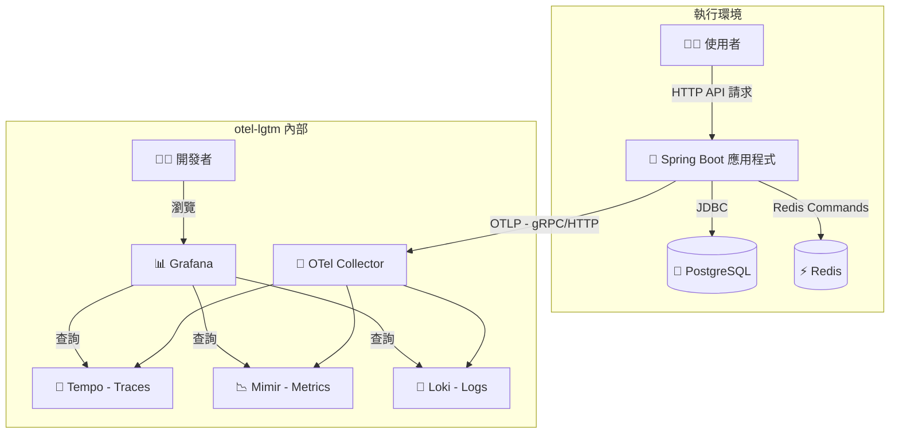
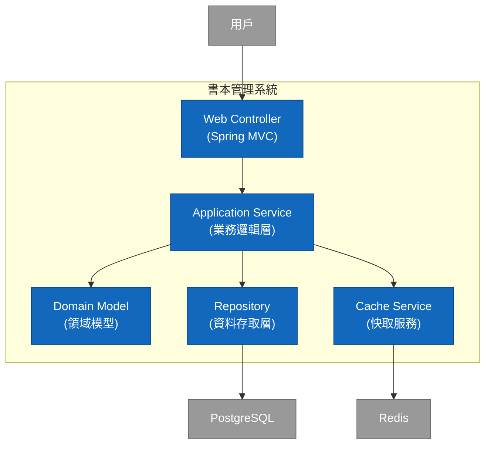

# Spring Boot 3 範例程式

## 簡介和目標

這份教學將帶領您完整解析一個基於 Java 21、Spring Boot 3.5 與 Gradle 8.x 的專案。我們將從專案設定開始，深入探討 JPA、Liquibase、Redis 快取 的使用，並聚焦於如何透過 Micrometer 與 OpenTelemetry (OTLP) 實現強大的可觀測性，最後將所有遙測數據發送到 Grafana LGTM 監控後端進行分析。

## 📁 專案結構概覽

本專案遵循常見的分層架構，將不同職責的程式碼清晰地分開，有助於維護和擴展。

```
.
├── build.gradle                # Gradle 建置腳本，定義專案依賴和任務
├── config/                     # 不應該被包進去 docker image 中的不同環境的設定檔
│   ├── application-local.yml   # "local" Profile 本機專用的設定檔
│   ├── application-ut.yml      # "ut" Profile 單元測試專用的設定檔
│   ├── application-sit.yml     # "sit" Profile 整合測試專用的設定檔
│   └── application-prod-example.yml     # "prod" Profile 正式環境參考用的設定檔(機敏資訊應該要放在secret manager 變數中 )
├── compose.yaml                # Docker Compose 設定，用於一鍵啟動本地開發環境 (DB, Redis, LGTM)
├── dev-resources/
│   └── openapi.yaml            # API 規格檔案 (Single Source of Truth)
└── src/
    ├── main/
    │   ├── java/com/example/demo/
    │   │   ├── applications/        # 應用層 (Service): 存放核心業務邏輯 (e.g., BookService)
    │   │   ├── config/              # 設定層: 存放 Spring 設定類別 (e.g., CacheConfig)
    │   │   ├── infrastructure/      # 基礎設施層: 存放資料庫存取相關介面 (e.g., BookRepository)
    │   │   ├── interfaces/          # 介面層: 存放與外部互動的程式碼
    │   │   │   ├── api/             # - (自動產生) OpenAPI 產生的 API 介面 (e.g., BooksApi)
    │   │   │   ├── dto/             # - (自動產生) OpenAPI 產生的資料傳輸物件 (e.g., BookDto)
    │   │   │   ├── mapper/          # - DTO 與 Entity 的轉換器 (e.g., BookMapper)
    │   │   │   └── rest/            # - REST Controller 的實作 (e.g., BookController)
    │   │   ├── models/              # 模型層: 存放 JPA 資料庫實體 (e.g., Book)
    │   │   └── DemoApplication.java # Spring Boot 應用程式進入點
    │   └── resources/
    │       ├── application.yml      # 最通用基礎的的 Spring Boot 設定檔
    │       ├── application-gcp.yml  # 針對 GCP 環境的設定檔(不包含環境變數)
    │       ├── application-aws.yml  # 針對 AWS 環境的設定檔(不包含環境變數)
    │       └── db/changelog/        # Liquibase 資料庫遷移腳本
    │           ├── db.changelog-master.yaml
    │           └── history/         # Liquibase 資料庫遷移紀錄
    └── test/                                    # 測試程式碼
        └── java/com/example/demo/
            ├── TestDemoApplication.java
            ├── TestcontainersConfiguration.java # Testcontainers 的設定
            └── DemoApplicationTests.java        # 整合測試
```

## 🛠️ 專案設定詳解

### 容器化環境 (compose.yaml)

我們使用 Docker Compose 來一鍵啟動所有外部依賴服務，包含 `postgres`, `redis` 和 `otel-lgtm`。這使得任何開發者都能快速地在本地建立起一個完整的開發與測試環境。

### 應用程式組態 (application.yml)

這是專案的控制中心，定義了應用程式的行為。

`spring.application.name: demo`: 極其重要！這個名稱會成為 OpenTelemetry 中的 service.name，是你在 Grafana 中篩選服務的依據。

`spring.threads.virtual.enabled: true`: 啟用 Java 21 的虛擬執行緒，提升 I/O 密集型應用的吞吐量。

`management.observations.annotations.enabled: true`: 啟用 @Observed 註解的總開關。

`management.opentelemetry.resource-attributes`: 為所有遙測數據附加的額外標籤，例如服務版本和部署環境，便於在後端進行分類和篩選。

`management.tracing.sampling.probability: 1.0`: 採樣率設為 1.0 (即 100%)。這在開發和測試時非常有用，可以確保你不會遺漏任何請求的追蹤。在生產環境中，為了效能和成本考量，通常會設定一個較低的值（例如 0.1）。

`management.otlp.*.endpoint`: 明確指定將 Metrics, Traces, Logs 發送到哪裡。這裡我們都指向 otel-lgtm 容器暴露的 4318 HTTP 埠。

### 資料庫版本控制 (db/changelog/*.yaml)

我們使用 Liquibase 來管理資料庫綱要 (Schema) 的演進，而不是讓 Hibernate 自動生成。這提供了更精確的版本控制，並確保在不同環境中資料庫結構的一致性。


## 🧩 核心技術與關鍵套件一覽

這個專案整合了業界主流且現代化的技術棧，以建構一個穩健、高效且易於維護的應用程式。

語言/框架: Java 21, Spring Boot 3.5.0

### 建置與工具外掛 (Plugins)

- `org.springframework.boot`
  Spring Boot 核心外掛，提供 bootRun 任務並將專案打包成可執行的 JAR。
- `io.spring.dependency-management`
  Spring 的依賴管理，讓我們可以省略常用函式庫的版本號，由 Spring Boot 統一控制。
- `org.openapi.generator`
  API First 的實踐核心。從 openapi.yaml 規格檔自動產生 Java 的 API 介面與 DTOs，確保程式碼與 API 規格的絕對一致性。
- `com.gorylenko.gradle-git-properties`
  產生一個包含當前 Git 狀態（如 commit ID、分支名稱）的 git.properties 檔案。這個檔案可以被 Actuator 的 /info 端點讀取，讓我們能精確知道生產環境中運行的到底是哪個版本的程式碼。
- `org.cyclonedx.bom`
  軟體物料清單 (SBOM) 產生器。它會產生一個 CycloneDX 格式的 BOM 檔案，詳細列出專案的所有組件及其依賴關係。這對於進行自動化的安全性漏洞掃描和授權合規性檢查至關重要。
- `jacoco`
  用於計算程式碼測試覆蓋率的工具，可以產生報告，幫助我們評估測試的完整性。

### 關鍵依賴 (Dependencies)

**API 與 Web 層**

- `spring-boot-starter-web`
  建構 RESTful API 的所有必需品，包含內嵌的 Tomcat 伺服器和 Spring MVC。

- `spring-boot-starter-validation`
  啟用 Java Bean Validation。讓我們可以在 DTO 上使用 @NotNull, @Size 等註解，Spring 會在處理請求時自動校驗傳入的資料是否符合規則。

- `springdoc-openapi-starter-webmvc-ui`
  自動整合 Swagger UI，基於我們的 Controller 和 OpenAPI 規格產生一個互動式的 API 文件頁面 (預設路徑 /swagger-ui.html)，非常方便在本機進行 API 測試。

- `mapstruct`
  和 annotationProcessor "org.mapstruct:mapstruct-processor": 一個高效能的物件映射工具，用於 DTO 與 Entity 之間的自動轉換。開發者只需定義介面，MapStruct 會在編譯時期產生具體實作，避免了手寫大量樣板程式碼的麻煩。

- `jackson-databind-nullable`
  這是 OpenAPI Generator 的一個輔助函式庫。它解決了 null 和 undefined (未提供) 在 JSON 中的區別，這對於處理 PATCH 這類部分更新的操作特別重要，可以精確判斷使用者是想將某個欄位設為 null，還是根本沒打算更新它。

**資料存取與快取層**

- `spring-boot-starter-data-jpa`
  簡化資料庫的 CRUD 操作，提供 JpaRepository 介面，底層使用 Hibernate 作為 ORM 實作。

- `liquibase-core`
  一個強大的資料庫遷移工具。讓我們可以用檔案 (如 YAML, XML, SQL) 來管理資料庫結構 (Schema) 的演進，實現資料庫的版本控制，確保各環境的一致性。

- `spring-boot-starter-cache`
  提供了一套統一的快取抽象 API。我們可以使用 @Cacheable, @CacheEvict 等註解來輕鬆地為方法加上快取邏輯，而不需要關心底層的快取實現是什麼。

- `spring-boot-starter-data-redis`
  整合 Redis。當它和 spring-boot-starter-cache 一起使用時，Spring Boot 會自動將 Redis 設定為快取的具體實現。

**可觀測性 (Observability) 層**

- `spring-boot-starter-actuator`
  所有可觀測性功能的基礎。它引入了 Micrometer，並提供了多個生產就緒的管理端點，如 /actuator/health, /actuator/info。

- `spring-boot-starter-aop`
  啟用 @Observed 的絕對關鍵。它提供了面向切面編程 (AOP) 的能力，讓 Micrometer 的 ObservedAspect 可以攔截被 @Observed 註解標記的方法，並在其前後自動加入產生指標和追蹤的邏輯。

- `io.micrometer:micrometer-tracing-bridge-otel`
  橋樑。它的作用是將 Micrometer Tracing API 的呼叫（例如當 @Observed 建立一個 Span 時）轉譯成 OpenTelemetry Tracer 能夠理解的指令。

- `io.opentelemetry:opentelemetry-exporter-otlp`
  追蹤與日誌匯出器。它包含了將追蹤數據（Traces）和日誌（Logs）打包成 OTLP 格式並透過網路傳送出去的具體實作。

- `io.opentelemetry.instrumentation:opentelemetry-spring-boot-starter`
  OTel 自動設定魔法包。它極大地簡化了整合，能自動偵測專案中的函式庫（如 Logback），並將 OTel 的功能（如日誌匯出）無縫整合進 Spring Boot 的生命週期中。

- `io.micrometer:micrometer-registry-otlp`
  指標匯出器。它是一個 Micrometer 的註冊表 (Registry) 實作，專門負責將 Micrometer 收集到的指標 (Metrics) 數據轉換為 OTLP 格式並發送出去。

- `io.micrometer:micrometer-registry-prometheus`
  Prometheus 指標端點。它提供了另一個指標註冊表，可以在 /actuator/prometheus 端點上暴露一個 Prometheus 格式的指標頁面。這在本地開發時非常有用，可以直接查看指標數據，而無需等待數據發送到後端。


## 🤝 API First 開發流程

本專案採用 API First 的開發模式。這意味著我們先在一個中立的、標準化的檔案 (openapi.yaml) 中定義 API 的規格（契約），然後再根據這份規格來產生程式碼的骨架。這份規格檔案是唯一的真相來源 (Single Source of Truth)，保證了 API 文件與實際程式碼的絕對一致性。

### 運作方式

我們透過 org.openapi.generator這個 Gradle 外掛來實現自動化。當你編譯專案時，它會執行以下步驟：

1. 讀取規格: 讀取位於 dev-resources/openapi.yaml 的 API 規格檔案。
2. 產生程式碼: 根據規格，在 build/generated/openapi 目錄下自動產生 Java 介面 (Interface) 和資料傳輸物件 (DTO)。
3. 納入編譯: 我們設定 sourceSets 將這個自動產生的目錄視為專案原始碼的一部分，使其能被正常編譯和使用。
4. 開發者實作: 開發者只需要專注於業務邏輯，去實作 (implement) 這些自動產生的介面即可。

`build.gradle` 中的關鍵設定  
讓我們看看 `openApiGenerate` 這個任務的設定細節：

```groovy
tasks.named('openApiGenerate') {
    generatorName.set("spring")
    library.set("spring-cloud")
    inputSpec.set(layout.projectDirectory.file("dev-resources/openapi.yaml").asFile.path) // API 規格來源
    outputDir.set(layout.buildDirectory.dir("generated/openapi").get().asFile.path)      // 程式碼輸出位置
    apiPackage.set("com.example.demo.interfaces.api")   // 產生的 API 介面要放在哪個 package
    modelPackage.set("com.example.demo.interfaces.dto") // 產生的 DTO 模型要放在哪個 package
    configOptions.set([
        interfaceOnly: "true",        // ✨ 只產生介面，不產生帶有 @RestController 的實作類別
        useResponseEntity: "true",    // 介面方法回傳 ResponseEntity，讓我們能完全控制 HTTP 響應
        useSpringBoot3: "true",       // 確保產生的程式碼與 Spring Boot 3 和 Jakarta EE 相容
        unhandledException: "true",   // 方法簽章會拋出 Exception，強制開發者處理例外
        useTags: "true",              // 根據 YAML 中的 "tags" 來產生不同的 API 介面 (例如 BooksApi)
        hateoas: "false"              // 在此專案中不使用 HATEOAS
    ])
}
```

最重要的設定是 `interfaceOnly: "true"`。它告訴產生器：「你只需要幫我定義好 `BooksApi` 這個介面長什麼樣子，以及 `BookDto`、`BookRequest` 這些 DTO 有哪些欄位。具體的 Controller 邏輯 (`BookController`) 我會自己寫。」

這種方式完美地分離了「API 的定義」和「業務邏輯的實現」。

**API First 的優點**  

**契約即文件**：`openapi.yaml` 本身就是最準確、最新的 API 文件。

**強迫一致性**：`BookController` 必須實作 `BooksApi` 介面，任何與規格不符的修改都會在編譯時期直接報錯。

**平行開發**：後端在實作業務邏輯的同時，前端或其他服務的開發者可以立即使用 `openapi.yaml` 來產生客戶端程式碼 (Client Stub) 或建立 Mock Server，無需等待後端開發完成。


### 現代化可觀測性

在現代軟體開發中，尤其是隨著微服務和分散式系統的普及，傳統的監控（Monitoring）方法已顯得捉襟見肘。傳統監控通常回答「系統是否正常運行？」這類問題，但當系統出現問題時，它很難告訴我們「為什麼會出問題？」以及「問題發生在哪裡？」。這就是現代化可觀測性（Observability）登場的時機。

可觀測性被定義為一種從系統外部輸出來推斷其內部狀態的能力 。它不僅僅是收集數據，更是要理解數據之間的關聯，從而深入洞察系統的行為。可觀測性主要建立在三大支柱之上 ：   

- 日誌 (Logs): 記錄了系統中發生的離散事件。它們回答了「發生了什麼？」的問題。日誌可以是結構化的（如 JSON），也可以是非結構化的文本。

- 指標 (Metrics): 是在一段時間內聚合的數值數據，通常用於衡量系統的整體健康狀況和性能。它們回答了「系統表現如何？」的問題，例如請求率、錯誤率、延遲等。

- 追蹤 (Traces): 描繪了一個請求在分散式系統中穿越多個服務的完整路徑。它們回答了「請求去了哪裡？」以及「為什麼這麼慢？」的問題。一個追蹤由多個跨度（Span）組成，每個跨度代表一個工作單元 。   

這三大支柱並非孤立存在。當它們被有效地關聯起來時，其威力才能完全展現。例如，您可以從一個異常的指標（如延遲飆升）下鑽到導致該異常的具體追蹤，再從該追蹤跳轉到相關的日誌，從而快速定位問題的根本原因。本教學的目標就是展示如何構建一個系統，實現這三大支柱的無縫關聯。



C4 Model - Container Diagram



## 運行時視圖 (Runtime View)

一次 API 請求的旅程  

讓我們看看當一個「新增書本」的請求 (POST /books) 進來時，系統內部發生了什麼事。


