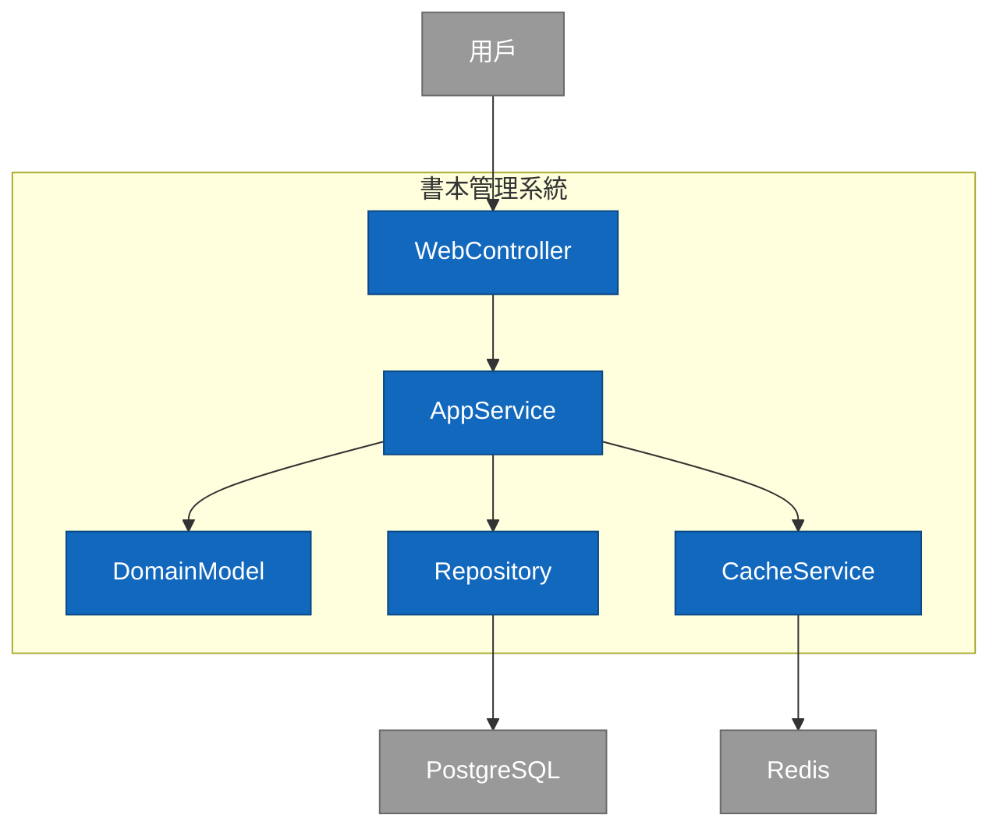
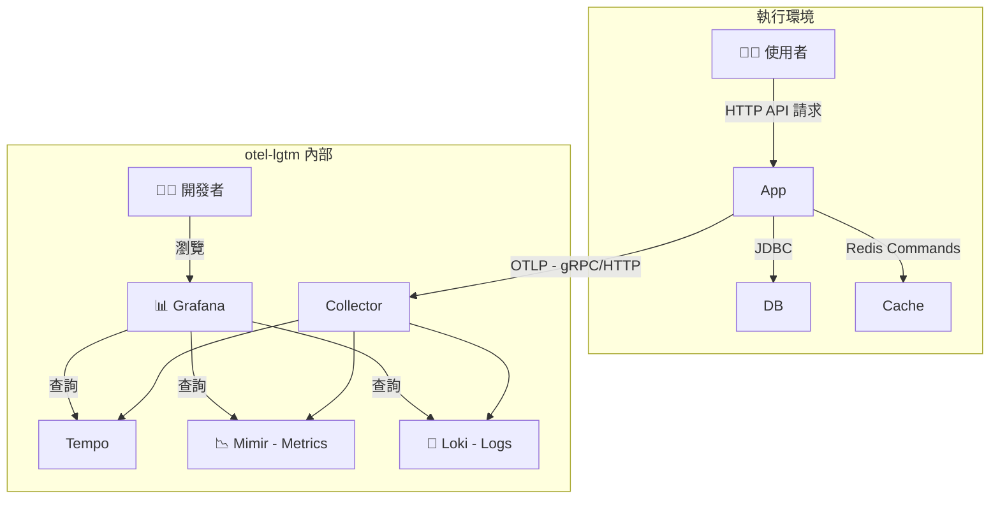
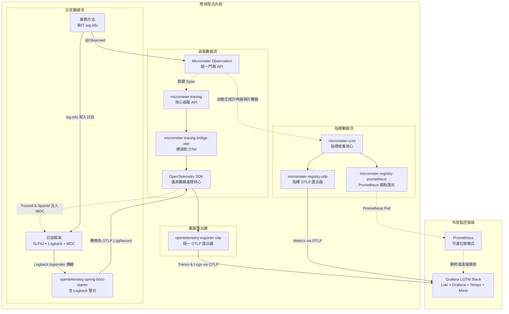

# Spring Boot 3 現代化專案實戰手冊

## 簡介與目標

這份開發者手冊旨在引導您了解一個基於 Java 21、Spring Boot 3.5 與 Gradle 的專案。我們的目標不僅是完成功能，也同樣重視專案的健壯性、效能與可維護性。  
我們將從專案設定開始，探討 JPA、Liquibase、Redis 快取的使用，並聚焦於如何透過 Micrometer 與 OpenTelemetry (OTLP) 實現可觀測性，最終將所有遙測數據發送到 Grafana LGTM 監控後端進行分析。本手冊為希望提升專案品質、採用業界常見實踐的開發人員設計。

---

## 軟體分層架構



---

## 📁 專案結構概覽

本專案遵循常見的分層架構，將不同職責的程式碼進行區隔，有助於後續的維護和擴展。  

```text
.
├── build.gradle                # Gradle 建置腳本，定義專案依賴和任務
├── config/                     # 不應該被包進去 docker image 中的不同環境的設定檔
│   ├── application-local.yml   # "local" Profile 本機專用的設定檔
│   ├── application-ut.yml      # "ut" Profile 單元測試專用的設定檔
│   ├── application-sit.yml     # "sit" Profile 整合測試專用的設定檔
│   └── application-prod-example.yml     # "prod" Profile 正式環境參考用的設定檔(機敏資訊應該要放在secret manager 變數中 )
├── compose.yaml                # Docker Compose 設定，用於一鍵啟動本地開發環境 (DB, Redis, LGTM)
├── dev-resources/
│   └── openapi.yaml            # API 規格檔案 (Single Source of Truth)
└── src/
    ├── main/
    │   ├── java/com/example/demo/
    │   │   ├── applications/        # 應用層 (Service): 存放核心業務邏輯 (e.g., BookService)
    │   │   ├── config/              # 設定層: 存放 Spring 設定類別 (e.g., CacheConfig)
    │   │   ├── infrastructure/      # 基礎設施層: 存放資料庫存取相關介面 (e.g., BookRepository)
    │   │   ├── interfaces/          # 介面層: 存放與外部互動的程式碼
    │   │   │   ├── api/             # - (自動產生) OpenAPI 產生的 API 介面 (e.g., BooksApi)
    │   │   │   ├── dto/             # - (自動產生) OpenAPI 產生的資料傳輸物件 (e.g., BookDto)
    │   │   │   ├── mapper/          # - DTO 與 Entity 的轉換器 (e.g., BookMapper)
    │   │   │   └── rest/            # - REST Controller 的實作 (e.g., BookController)
    │   │   ├── models/              # 模型層: 存放 JPA 資料庫實體 (e.g., Book)
    │   │   └── DemoApplication.java # Spring Boot 應用程式進入點
    │   └── resources/
    │       ├── application.yml      # 最通用基礎的的 Spring Boot 設定檔
    │       ├── application-gcp.yml  # 針對 GCP 環境的設定檔(不包含環境變數)
    │       ├── application-aws.yml  # 針對 AWS 環境的設定檔(不包含環境變數)
    │       └── db/changelog/        # Liquibase 資料庫遷移腳本
    │           ├── db.changelog-master.yaml
    │           └── history/         # Liquibase 資料庫遷移紀錄
    └── test/                                    # 測試程式碼
        └── java/com/example/demo/
            ├── TestDemoApplication.java
            ├── TestcontainersConfiguration.java # Testcontainers 的設定
            └── DemoApplicationTests.java        # 整合測試
```

---

## 🧩 核心技術與關鍵套件一覽

本專案採用了一系列業界常見的技術棧，用以建構應用程式。  

### 語言/框架

Java 21, Spring Boot 3.5.0  

### 建置與工具外掛 (Plugins)

- **`org.springframework.boot`**  
  Spring Boot 核心外掛，提供 `bootRun` 任務並將專案打包成可執行的 JAR。
- **`io.spring.dependency-management`**  
  Spring 的依賴管理，讓我們可以省略常用函式庫的版本號，由 Spring Boot 統一控制。
- **`org.openapi.generator`**  
  API First 的實踐核心。從 `openapi.yaml` 規格檔自動產生 Java 的 API 介面與 DTOs，確保程式碼與 API 規格的一致性。
- **`com.gorylenko.gradle-git-properties`**  
  產生一個包含當前 Git 狀態（如 commit ID、分支名稱）的 `git.properties` 檔案。這個檔案可以被 Actuator 的 `/info` 端點讀取，讓我們能精確知道生產環境中運行的到底是哪個版本的程式碼。 ¹
- **`org.cyclonedx.bom`**  
  軟體物料清單 (SBOM) 產生器。它會產生一個 CycloneDX 格式的 BOM 檔案，詳細列出專案的所有組件及其依賴關係。這對於進行自動化的安全性漏洞掃描和授權合規性檢查至關重要。 ⁵
- **`jacoco`**  
  用於計算程式碼測試覆蓋率的工具，可以產生報告，幫助我們評估測試的完整性。

### 關鍵依賴 (Dependencies)

#### API 與 Web 層

- **`spring-boot-starter-web`**  
  建構 RESTful API 的所有必需品，包含內嵌的 Tomcat 伺服器和 Spring MVC。
- **`spring-boot-starter-validation`**  
  啟用 Java Bean Validation。讓我們可以在 DTO 上使用 `@NotNull`, `@Size` 等註解，Spring 會在處理請求時自動校驗傳入的資料是否符合規則。
- **`springdoc-openapi-starter-webmvc-ui`**  
  自動整合 Swagger UI，基於我們的 Controller 和 OpenAPI 規格產生一個互動式的 API 文件頁面 (預設路徑 `/swagger-ui.html`)，方便在本機進行 API 測試。
- **`mapstruct`** 和 **`annotationProcessor "org.mapstruct:mapstruct-processor"`**  
  一個編譯期執行的物件映射工具，用於 DTO 與 Entity 之間的轉換，避免手寫重複的映射程式碼。
- **`jackson-databind-nullable`**  
  這是 OpenAPI Generator 的一個輔助函式庫。它解決了 `null` 和 `undefined` (未提供) 在 JSON 中的區別，這對於處理 PATCH 這類部分更新的操作特別重要，可以精確地判斷使用者是想將某個欄位設為 `null`，還是根本沒打算更新它。

#### 資料存取與快取層

- **`spring-boot-starter-data-jpa`**  
  簡化資料庫的 CRUD 操作，提供 JpaRepository 介面，底層使用 Hibernate 作為 ORM 實作。
- **`liquibase-core`**  
  一個資料庫遷移工具。讓我們可以用檔案 (如 YAML, XML, SQL) 來管理資料庫結構 (Schema) 的演進，實現資料庫的版本控制，確保各環境的一致性。  
- **`spring-boot-starter-cache`**  
  提供了一套統一的快取抽象 API。我們可以使用 `@Cacheable`, `@CacheEvict` 等註解為方法加上快取邏輯，而不需要耦合底層的快取實現。
- **`spring-boot-starter-data-redis`**  
  整合 Redis。當它和 `spring-boot-starter-cache` 一起使用時，Spring Boot 會自動將 Redis 設定為快取的具體實現。

#### 可觀測性 (Observability) 層

- **`spring-boot-starter-actuator`**  
  可觀測性功能的基礎。它引入了 Micrometer，並提供了多個生產就緒的管理端點，如 `/actuator/health`, `/actuator/info`。
- **`spring-boot-starter-aop`**  
  啟用 `@Observed` 的關鍵。它提供了面向切面編程 (AOP) 的能力，讓 Micrometer 的 `ObservedAspect` 可以攔截被 `@Observed` 註解標記的方法，並在其前後自動加入產生指標和追蹤的邏輯。
- **`io.micrometer:micrometer-tracing-bridge-otel`**  
  橋接器。它的作用是將 Micrometer Tracing API 的呼叫（例如當 `@Observed` 建立一個 Span 時）轉譯成 OpenTelemetry Tracer 能夠理解的指令。
- **`io.opentelemetry:opentelemetry-exporter-otlp`**  
  追蹤與日誌匯出器。它包含了將追蹤數據（Traces）和日誌（Logs）打包成 OTLP 格式並透過網路傳送出去的具體實作。
- **`io.opentelemetry.instrumentation:opentelemetry-spring-boot-starter`**  
  OTel 自動設定套件。它簡化了整合工作，能自動偵測專案中的函式庫（如 Logback），並將 OTel 的功能（如日誌匯出）整合進 Spring Boot 的生命週期中。
- **`io.micrometer:micrometer-registry-otlp`**  
  指標匯出器。它是一個 Micrometer 的註冊表 (Registry) 實作，負責將 Micrometer 收集到的指標 (Metrics) 數據轉換為 OTLP 格式並發送出去。
- **`io.micrometer:micrometer-registry-prometheus`**  
  Prometheus 指標端點。它提供了另一個指標註冊表，可以在 `/actuator/prometheus` 端點上暴露一個 Prometheus 格式的指標頁面。這在本地開發時很實用，可以直接查看指標數據。

---

## 🛠️ 開發與設定

### 開發指南

- 當 `openapi.yaml` 有更動時，需手動執行 `./gradlew clean openApiGenerate` 重新生成 API 相關介面。
- 使用 `./gradlew bootRun --args='--spring.profiles.active=local'` 指令來啟動本機環境。
- 本機 Swagger UI 位置：`http://localhost:8080/swagger-ui.html`

### VSCode 設定

#### 建立 launch.json

可以手動建立 `.vscode/launch.json` 檔案，或透過 VSCode 左側的 **Run and Debug** 面板新增配置。
此設定的作用是在透過 IDE 啟動 Spring Boot 應用時，可以為其指定 `profile`，讓應用在本地環境中載入對應的設定檔 (例如 `application-local.yml`)。

```json
{
    "version": "0.2.0",
    "configurations": [
        {
            "type": "java",
            "name": "Current File",
            "request": "launch",
            "mainClass": "${file}"
        },
        {
            "type": "java",
            "name": "DemoApplication",
            "request": "launch",
            "mainClass": "com.example.demo.DemoApplication",
            "projectName": "demo-springboot-250613",
            "env": {
                "spring.profiles.active": "local"
            }
        },
        {
            "type": "java",
            "name": "TestDemoApplication",
            "request": "launch",
            "mainClass": "com.example.demo.TestDemoApplication",
            "projectName": "demo-springboot-250613"
        }
    ]
}
```

---

## 🤝 API First 開發流程

本專案採用 **API First** 的開發模式。這意味著我們先在一個中立的、標準化的檔案 (`openapi.yaml`) 中定義 API 的規格（契約），然後再根據這份規格來產生程式碼的骨架。這份規格檔案是**唯一的真相來源 (Single Source of Truth)**，用以確保 API 文件與實際程式碼的一致性。  

### 運作方式

我們透過 `org.openapi.generator`這個 Gradle 外掛來實現自動化。當你編譯專案時，它會執行以下步驟：  

1. **讀取規格**: 讀取位於 `dev-resources/openapi.yaml` 的 API 規格檔案。
2. **產生程式碼**: 根據規格，在 `build/generated/openapi` 目錄下自動產生 Java 介面 (Interface) 和資料傳輸物件 (DTO)。
3. **納入編譯**: 我們設定 `sourceSets` 將這個自動產生的目錄視為專案原始碼的一部分，使其能被正常編譯和使用。
4. **開發者實作**: 開發者只需要專注於業務邏輯，去實作 (implement) 這些自動產生的介面即可。

### build.gradle 中的關鍵設定

讓我們看看 `openApiGenerate` 這個任務的設定細節：  

```groovy
tasks.named('openApiGenerate') {
    generatorName.set("spring")
    library.set("spring-cloud")
    inputSpec.set(layout.projectDirectory.file("dev-resources/openapi.yaml").asFile.path) // API 規格來源
    outputDir.set(layout.buildDirectory.dir("generated/openapi").get().asFile.path)      // 程式碼輸出位置
    apiPackage.set("com.example.demo.interfaces.api")   // 產生的 API 介面要放在哪個 package
    modelPackage.set("com.example.demo.interfaces.dto") // 產生的 DTO 模型要放在哪個 package
    configOptions.set([
        hateoas: "false",
        interfaceOnly: "true",        // ✨ 只產生介面，不產生實作
        useResponseEntity: "true",    // ✨ 使用 Spring 的 ResponseEntity<T> 作為回傳型別
        useSpringBoot3: "true",       // ✨ 確保與 Spring Boot 3 相容
        useTags: "true",              // ✨ 根據 YAML 中的 "tags" 產生不同 API 介面
        unhandledException: "true"    // ✨ 強制開發者處理例外
    ])
}
```

ConfigOptions 重要參數解析

- interfaceOnly: "true"

  - 用途: 只產生 API 介面，不產生 Controller 實作類別
  - 優點: 開發者可以自由實作業務邏輯，保持程式碼的彈性
  - 結果: 產生如 UserApi.java 介面，而非 UserApiController.java 實作類別

- useSpringBoot3: "true"

  - 重要性: 確保生成的程式碼與 Spring Boot 3.x 相容
  - 影響: 使用正確的 Jakarta EE 註解（而非舊的 javax）
  - 範例: 生成 @jakarta.validation.Valid 而非 @javax.validation.Valid

- useTags: "true"

  - 功能: 根據 OpenAPI 規格中的 tags 分組產生不同的 API 介面
  - 範例: 如果 YAML 中有 tags: [users, orders]，會產生 UsersApi.java 和 OrdersApi.java
  - 好處: 避免單一巨大的 API 介面，提升程式碼可維護性

- useResponseEntity: "true"

  - 用途: 使用 Spring 的 ResponseEntity<T> 作為回傳型別
  - 優點: 可以精確控制 HTTP 狀態碼、標頭等回應細節
  - 範例: ResponseEntity<User> getUser(Long id) 而非 User getUser(Long id)

- unhandledException: "true"

  - 目的: 強制開發者明確處理可能的例外情況
  - 效果: 在方法簽名中加入 throws Exception
  - 建議: 搭配 @ControllerAdvice 統一處理例外

- hateoas: "false"

  - 說明: 不啟用 HATEOAS（Hypermedia as the Engine of Application State）
  - 適用: 一般 RESTful API 通常不需要 HATEOAS 功能

其中 `interfaceOnly: "true"` 的設定，告訴產生器只需定義 API 介面與 DTO，而 Controller 的具體邏輯由開發者自行編寫。這種方式有助於分離「API 的定義」和「業務邏輯的實現」。  

### API First 的優點

- **契約即文件**：`openapi.yaml` 本身就是最準確的 API 文件。
- **強制一致性**：`BookController` 必須實作 `BooksApi` 介面，任何與規格不符的修改都會在編譯時期引發錯誤。
- **平行開發**：後端在實作業務邏輯的同時，前端或其他服務的開發者可以使用 `openapi.yaml` 來產生客戶端程式碼 (Client Stub) 或建立 Mock Server，無需等待後端開發完成。

---

## 🗺️ 物件映射 (MapStruct)

- `org.mapstruct:mapstruct`
- `org.mapstruct:mapstruct-processor` (annotationProcessor)

### 用途

在分層架構中，通常不希望將資料庫實體 (Entity) 直接暴露給外部 API。因此，需要定義資料傳輸物件 (DTO)。MapStruct 是一個編譯期執行的 Java Bean 映射工具，用來處理 DTO 與 Entity 之間的轉換問題。  

### 優點

- **效能**: 在編譯期產生原生 Java 程式碼，沒有執行期的反射或代理，效能表現良好。
- **型別安全**: 所有映射都在編譯期檢查，若有欄位不匹配或型別錯誤，編譯會失敗。
- **減少樣板程式碼**: 開發者只需定義一個介面，MapStruct 就會自動產生對應的 get/set 程式碼。

### build.gradle中的關鍵設定

```groovy
tasks.withType(JavaCompile) {
    options.compilerArgs = [
            '-Amapstruct.defaultComponentModel=spring' // 告訴 MapStruct 預設產生 Spring Bean
    ]
}
```

### Mapper 介面定義 (`BookMapper.java`)

我們定義了 `BookMapper` 介面，並使用 `@Mapper` 註解標記。透過設定 `componentModel = "spring"`，MapStruct 會在其生成的實現類別 `BookMapperImpl` 上加上 `@Component` 註解，使其可以作為一個 Spring Bean 被注入到其他服務中。

```java
@Mapper(
    componentModel = "spring", // 讓 MapStruct 產生 Spring Bean
    unmappedTargetPolicy = ReportingPolicy.IGNORE
)
public interface BookMapper {
    // 將 BookDto (DTO) 轉換為 Book (Entity)
    Book toEntity(BookDto dto);

    // 將 Book (Entity) 轉換為 BookDto (DTO)
    BookDto toDto(Book entity);
}
```

### 使用範例

```java
@RestController
@RequiredArgsConstructor // 自動注入 final 的欄位
public class BookController implements BooksApi {

    private final BookService bookService;
    private final BookMapper bookMapper; // ✨ MapStruct Mapper 被注入

    @Override
    public ResponseEntity<BookDto> booksPost(@Valid BookRequest bookRequest) {
        // 呼叫 mapper 將傳入的 Request DTO 轉為 Entity
        Book bookEntity = bookMapper.toEntity(bookRequest);
        Book createdBook = bookService.createBook(bookEntity);
        // 呼叫 mapper 將回傳的 Entity 轉為 Response DTO
        return ResponseEntity.status(HttpStatus.CREATED).body(bookMapper.toDto(createdBook));
    }
}
```

---

## 📜 資料庫版本控制 (Liquibase)

在團隊開發中，管理資料庫結構 (Schema) 的變更是一大挑戰。如果每個人都在本地隨意修改資料庫，或依賴 JPA 的 `ddl-auto: update`，可能導致開發、測試和正式環境的資料庫結構不一致，引發難以追蹤的錯誤。  
本專案採用 Liquibase 將資料庫的變更像程式碼一樣進行版本控制，以確保所有環境的資料庫結構都是一致且可追溯的。  

### 為什麼不用 ddl-auto?

雖然 `spring.jpa.hibernate.ddl-auto = update` 在開發初期很方便，但它存在一些問題：  

- **缺乏控制**: 你無法精確控制它產生的 SQL。
- **資料遺失風險**: 在某些情況下可能導致資料遺失。
- **無版本紀錄**: 你不知道資料庫在何時、被誰、做了哪些變更。
- **不適用於正式環境**: 在正式環境使用 `update` 是不被推薦的。

Liquibase 透過一個更嚴謹的流程來應對這些問題。  

### Liquibase 如何運作？

- **自動執行**: 當 Spring Boot 應用程式啟動時，它會自動偵測到 Liquibase 的存在，並執行資料庫的遷移。  
- **變更日誌 (Changelog)**: 開發者將所有資料庫變更（如建表、加欄位）定義在「變更日誌」檔案中。在本專案中，我們使用 YAML 格式。  
- **追蹤表**: Liquibase 會在你的資料庫中建立兩張追蹤表：`DATABASECHANGELOG` 和 `DATABASECHANGELOGLOCK`。  
  - `DATABASECHANGELOGLOCK`: 用來確保在同一時間只有一個應用程式實例在執行資料庫遷移，防止衝突。  
  - `DATABASECHANGELOG`: 記錄每一個已經被成功執行的變更集 (changeSet)。應用程式每次啟動時，Liquibase 會比對日誌檔案和這張表，只執行那些尚未被記錄的、新的變更集。  

### 專案實踐

#### 主變更日誌 (Master Changelog)

這是 Liquibase 的進入點，位於 `src/main/resources/db/changelog/db.changelog-master.yaml`。它本身不包含具體的變更，而是像一個目錄，負責引入其他的變更日誌檔案。  

```yaml
# db.changelog-master.yaml
databaseChangeLog:
  - include:
      file: history/20250614.yaml
      relativeToChangelogFile: true # 路徑相對於當前檔案
      description: 初始化表格
  # ✨ 當有新的變更時，在這裡加入新的 include
  # - include:
  #     file: history/20250615.yaml
  #     relativeToChangelogFile: true
  #     description: 新增使用者表格
```

#### 變更集檔案 (Changeset File)

所有實際的資料庫結構變更都定義在這些檔案裡。我們將它們存放在 `history/` 目錄下，並以日期命名，方便追溯。
一個檔案可以包含多個 `changeSet`。每個 `changeSet` 都是一個不可變的、原子的資料庫操作單元，由 `id` 和 `author` 唯一識別。
讓我們看看 `history/20250614.yaml` 的內容：

```yaml
# history/20250614.yaml
databaseChangeLog:
- changeSet:
    id: 1749857749130-1 # 唯一 ID，可以是數字、字串或自動生成
    author: samzhu (generated)
    changes:
    - createTable:
        tableName: book
        remarks: 書本資料表，用於儲存書本的基本資訊
        columns:
        - column:
            name: id
            type: INTEGER
            autoIncrement: true
            constraints:
              primaryKey: true
              nullable: false
        - column:
            name: title
            type: VARCHAR(255)
            constraints:
              nullable: false
        #... 其他欄位...
```

#### 開發流程：如何新增一筆資料庫變更？

假設你需要為 `book` 表增加一個 `stock_quantity`（庫存數量）欄位。

1. **建立新檔案**: 在 `src/main/resources/db/changelog/history/` 目錄下建立一個新的 YAML 檔案，例如 `20250616-add-stock-to-book.yaml`。
2. **定義 ChangeSet**: 在新檔案中，加入你的變更集。`id` 必須是唯一的。
3. **更新主檔案**: 在 `db.changelog-master.yaml` 中引入你剛剛建立的檔案。

    ```yaml
    databaseChangeLog:
      - include:
          file: history/20250614.yaml
          relativeToChangelogFile: true
          description: 初始化表格
      - include: # ✨ 新增這一段
          file: history/20250616-add-stock-to-book.yaml
          relativeToChangelogFile: true
          description: 為書本新增庫存欄位
    ```

4. **啟動應用**: 重新啟動 Spring Boot 應用。Liquibase 會檢查 `DATABASECHANGELOG` 表，發現這個新的 `changeSet` 還沒有被執行過，於是它會執行對應的 `ALTER TABLE` SQL 命令，為你的資料庫加上新欄位。  

這個流程確保了每一次資料庫的變更都有紀錄、可追蹤，並且能在團隊所有成員和所有環境中自動且一致地被應用。  

---

## ⚡️ 快取機制 (Spring Cache + Redis)

為了提升應用程式的回應速度並降低資料庫的負載，我們引入了快取機制。對於那些不常變動但讀取頻繁的資料，快取有助於提升效能。 ³³
本專案採用 **Spring Cache** 作為抽象層，並以 **Redis** 作為具體的快取實現。  

### Spring Cache: 一致的快取抽象

`spring-boot-starter-cache` 提供了一套標準的快取抽象 API。它的優點是讓業務邏輯程式碼與具體的快取技術解耦。開發者只需使用幾種標準註解，就能為方法加上快取功能。  

- `@EnableCaching`: 在設定類別上使用，是啟用 Spring Cache 功能的總開關。  
- `@Cacheable`: 用於讀取操作。在執行方法前，Spring 會先檢查快取中是否存在對應的資料。如果存在，則直接從快取返回；如果不存在，則執行方法，並將其回傳結果存入快取後再返回。  
- `@CacheEvict`: 用於寫入或刪除操作。當資料發生變更時，用來從快取中清除對應的資料，以避免使用者讀到過期的舊資料。  

### Redis: 高效能的快取實現

我們選擇 Redis 作為快取伺服器。得益於 Spring Boot 的自動設定，整合過程很直接：  

1. 在 `build.gradle` 中加入 `spring-boot-starter-data-redis` 依賴。  
2. 在 `application.yml` 中設定 Redis 的連線資訊。  

只要這兩步完成，Spring Boot 就會自動建立一個 `RedisCacheManager` 作為 Spring Cache 的預設實現。  

### Cache實踐

可參考在 `BookService` 中實現的快取功能。  

#### 策略：只快取高頻讀取的單一項目

在新的設計中，我們採取了更精確的快取策略。我們意識到 `getAllBooks()`（獲取所有書本）這個操作可能返回較大的數據量，且列表內容會因任何書籍的增刪改而頻繁變動，快取整個列表的效益不高。  
因此，我們的策略是：**只快取 `getBookById(id)` 這種高頻率、讀取單一項目的操作**。  

#### 1. 啟用快取功能

我們在 `CacheConfig.java` 中啟用快取，並定義快取空間的名稱。  

```java
// src/main/java/com/example/demo/config/CacheConfig.java
@Configuration
@EnableCaching // ✨ 啟用快取總開關
public class CacheConfig {
    /**
     * 書本快取的名稱常量
     */
    public static final String BOOKS_CACHE = "books";
}
```

#### 2. 快取單一書本的讀取操作

我們只在 `getBookById` 方法上加上 `@Cacheable`。注意 `key` 的寫法，我們使用了 Spring Expression Language (SpEL) 來組合一個更有意義的鍵值。  

```java
// src/main/java/com/example/demo/applications/BookService.java
@Service
public class BookService {
    //...

    /**
     * 根據 ID 獲取書本
     * @Cacheable - 將結果存入 'books' 快取，並以 'book_{id}' 作為 key
     */
    @Cacheable(cacheNames = CacheConfig.BOOKS_CACHE, key = "'book_' + #id")
    public Book getBookById(Integer id) {
        log.info("從資料庫獲取書本 ID: {}", id); // ✨ 這行 log 只會在快取未命中時印出
        return bookRepository.findById(id)
           .orElseThrow(() -> new ResponseStatusException(HttpStatus.NOT_FOUND, "找不到指定的書本"));
    }
}
```

`key = "'book_' + #id"`: 這是一個有用的實踐。它為所有書本相關的快取鍵加上了 `book_` 前綴。這樣，當 `id` 為 `123` 時，在 Redis 中儲存的鍵就是 `book_123`，而不是單純的 `123`。這提高了鍵的可讀性，並避免了與其他可能也使用數字 ID 的快取（例如 `user_123`）發生衝突。  

#### 3. 精確地清除單一快取

因為我們不再快取 `getAllBooks()` 的列表，所以在更新或刪除時，我們也不需要使用 `allEntries = true` 來清空所有快取。我們只需要精確地清除被修改或刪除的那一本書的快取即可。  

```java
// src/main/java/com/example/demo/applications/BookService.java
@Service
public class BookService {
    //...

    /**
     * 更新書本
     * @CacheEvict - 只清除 'books' 快取中 'book_{id}' 這個 key 對應的資料
     */
    @Transactional
    @CacheEvict(cacheNames = CacheConfig.BOOKS_CACHE, key = "'book_' + #id")
    public Book updateBook(Integer id, Book book) {
        //...
    }

    /**
     * 刪除書本
     * @CacheEvict - 同樣，只清除被刪除的特定書本快取
     */
    @Async
    @Transactional
    @CacheEvict(cacheNames = CacheConfig.BOOKS_CACHE, key = "'book_' + #id")
    public void deleteBook(Integer id) {
        //...
    }
}
```

`createBook` 方法現在不需要任何 `@CacheEvict` 註解。因為新增一本書，並不會讓任何既有的快取資料變得「過期」。  

#### 策略的優勢

這種「只快取單一項目」的策略更為簡潔且高效：  

- **邏輯簡單**: 不再需要處理列表快取失效的問題。  
- **效能**: 為最常見的「根據 ID 查詳情」場景提供了效能上的幫助。  
- **寫入操作**: 更新或刪除操作對快取的影響降到最低，只精確地操作一個鍵，不會影響其他有效的快取。  

---

## 🚀 效能提升：Java 21 虛擬執行緒

本專案啟用 Java 21 的特性之一：**虛擬執行緒 (Virtual Threads)**。  

### 傳統執行緒的問題

在傳統模型中，一個 Java 執行緒 (Platform Thread) 就會佔用一個作業系統執行緒。對於像 Web 服務這樣 I/O 密集的應用（大量時間花在等待資料庫、快取或其他 API 回應），作業系統執行緒會長時間處於阻塞狀態，但依然佔用著記憶體和核心資源，導致系統能同時處理的請求數量受限。  

### 虛擬執行緒的優勢

虛擬執行緒是由 JVM 管理的輕量級執行緒。成千上萬個虛擬執行緒可以運行在少數幾個平台執行緒之上。當一個虛擬執行緒執行一個阻塞 I/O 操作時：  

1. 它不會阻塞作業系統執行緒。  
2. JVM 會將其暫停，並讓底層的作業系統執行緒去處理另一個虛擬執行緒的任務。  
3. 當 I/O 操作完成後，JVM 會再喚醒原來的虛擬執行緒繼續執行。  

這種機制有助於提升 I/O 密集型應用的吞吐量，讓應用程式能用更少的硬體資源處理更多的併發請求。  

### 如何啟用？

在 Spring Boot 3.2+ 中，啟用虛擬執行緒只需在 `application.yml` 中加入一行設定：  

```yaml
spring:
  threads:
    virtual:
      enabled: true
```

這行設定會告訴 Spring Boot 使用虛擬執行緒來處理所有傳入的 HTTP 請求。  

---

## 🔬 現代化可觀測性 (Observability) - 第一部分：Spring 的實踐

在我們的應用程式中，「可觀測性」是為了解決一個核心問題：當應用程式運行時，如何深入理解其內部行為，從而快速地診斷問題、優化效能。這套系統建立在三大支柱之上：**指標 (Metrics)**、**追蹤 (Traces)** 和 **日誌 (Logs)**。  

- **日誌 (Logs)**: 記錄了系統中發生的離散事件。它們回答了「發生了什麼？」的問題。日誌可以是結構化的（如 JSON），也可以是非結構化的文本。  
- **指標 (Metrics)**: 是在一段時間内聚合的數值數據，通常用於衡量系統的整體健康狀況和性能。它們回答了「系統表現如何？」的問題，例如請求率、錯誤率、延遲等。  
- **追蹤 (Traces)**: 描繪了一個請求在分散式系統中穿越多個服務的完整路徑。它們回答了「請求去了哪裡？」以及「為什麼這麼慢？」的問題。一個追蹤由多個跨度（Span）組成，每個跨度代表一個工作單元 。  

### Spring 的現代觀測哲學

在開始撰寫任何觀測性程式碼之前，先理解 Spring Boot 3 的觀測哲學。Micrometer 與 Spring Observability 的核心開發者 Jonatan Ivanov 強調：  

> “In these apps I don't create any Observations manually because basically everything that I would need is automatically instrumented…”
> (在這些應用程式中，我沒有手動建立任何觀測，因為我所需要的基本上都已經被我使用的框架/函式庫自動檢測了…)

這段話揭示了一個核心思想：**優先依賴自動化檢測 (Rely on Automatic Instrumentation First)**。  
當我們引入 `spring-boot-starter-actuator` 和相關的可觀測性依賴時，Spring Boot 的生態系統已經為我們自動檢測了大量常見的技術互動，包括：  

- 傳入的 HTTP Server 請求  
- 發出的 RestTemplate 請求  
- 資料庫 JDBC 查詢  
- Redis 操作  
- ...等等  

這意味著我們無需任何額外設定，就能在監控後台看到這些基礎設施層面的指標和追蹤。  

那麼，我們什麼時候才需要自己動手？  
**答案是：當自動化檢測無法觸及，而我們又想深入洞察其內部行為的自訂核心業務邏輯時。**例如，在我們的 `BookService` 中，`createBook` 方法包含了檢查 ISBN、設定時間戳、儲存實體等多個步驟。我們希望將整個 `createBook` 操作視為一個獨立的、有業務意義的單元來進行觀測。  
這就是 Micrometer 和 `@Observed` 註解可以發揮作用的地方。  

### `@Observed`: 一種適用於觀測核心業務邏輯的工具

Micrometer 是 Spring 官方指定的觀測性門面 (Facade)，它提供了一套標準化的 API，讓我們的程式碼可以專注於「觀測的意圖」，而不用關心底層的實現細節。  
在 Micrometer 的生態中，`@Observed` 註解是為我們的自訂業務邏輯加上觀測能力的一種有效實踐。Jonatan Ivanov 闡述了其核心價值：  

> “The idea... was that we want the users to instrument their code once using a single API and have multiple benefits out of it (e.g. metrics, tracing, logging).”
> (我們的初衷是，希望使用者能用一套 API 來檢測他們的程式碼一次，並從中獲得多重效益，例如：指標、追蹤、日誌。)

這就是 `@Observed` 的核心理念：**「一次檢測，多重效益」**。  

#### 為何不直接用 SDK 或 Java Agent？  

- **相較於直接使用 OpenTelemetry SDK**: 直接使用 SDK 需要你手動編寫 Span 的開始、結束、設定屬性、管理上下文等程式碼，不僅工作量大，而且容易出錯或遺漏，同時也讓業務程式碼與特定工具緊密耦合。`@Observed` 以宣告式的方式將這一切都自動化了。
- **相較於使用 OpenTelemetry Java Agent**: Agent 對於自動檢測第三方函式庫很有效，但它無法理解你自訂的業務方法（如 `createBook`）的具體語義和命名。`@Observed` 則讓你能夠精確地為業務方法命名，使其在監控後台具有更清晰的可讀性。

`@Observed` 註解在宣告式觀測與程式碼侵入性之間，提供了一個較好的平衡。它比直接使用 SDK 簡潔，同時又比 Java Agent 在檢測自訂業務邏輯時更具彈性。  

### `@Observed` 啟用與實踐指南

隨著 Spring Boot 的版本演進，使用 `@Observed` 的設定已相當簡化。

#### 步驟 1：加入核心依賴

在 `build.gradle` 中，確保有以下兩個關鍵依賴：

```groovy
// build.gradle
dependencies {
    // 提供了 Micrometer 觀測功能的基礎，是所有觀測功能的基石
    implementation 'org.springframework.boot:spring-boot-starter-actuator'

    // 提供了 AOP (面向切面編程) 的能力，這是 @Observed 能運作的技術基礎
    implementation 'org.springframework.boot:spring-boot-starter-aop'
}
```

#### 步驟 2：開啟全域開關

在 `application.yml` 中，明確地啟用基於註解的觀測功能： ³⁴

```yaml
# src/main/resources/application.yml
management:
  observations:
    annotations:
      enabled: true  # @Observed 功能的總開關
```

#### 步驟 3：設定非同步追蹤 (如有需要)

Jonatan Ivanov 提到，從 Spring Boot 3.2.0 開始，`ObservedAspect` 這個讓 `@Observed` 生效的核心 Bean 已經被 Spring Boot 自動設定了。因此，你不再需要手動去宣告 `ObservedAspect` 的 `@Bean`。  
現在，只有當你的專案中使用了 `@Async` 等非同步處理時，為了確保追蹤上下文能夠在不同執行緒之間正確傳播，你才需要建立以下的設定檔：  

```java
// src/main/java/com/example/demo/config/ObservabilityConfig.java
@Configuration(proxyBeanMethods = false)
public class ObservabilityConfig {

    /**
     * 為了讓追蹤在非同步執行緒中也能正確傳播，我們需要配置一個 TaskExecutor。
     * ContextPropagatingTaskDecorator 會自動將當前執行緒的追蹤上下文 (如 traceId) 複製到
     * 即將執行 @Async 任務的新執行緒中，確保追蹤鏈的完整性。
     */
    @Bean
    public TaskExecutor taskExecutor() {
        ThreadPoolTaskExecutor executor = new ThreadPoolTaskExecutor();
        executor.setTaskDecorator(new ContextPropagatingTaskDecorator());
        return executor;
    }
}
```

**注意**：如果您的專案中完全沒有使用 `@Async`，那麼您甚至不需要建立 `ObservabilityConfig.java` 這個檔案。

#### 步驟 4：在業務邏輯中應用註解

`BookService` 程式碼在 `@Observed` 的使用上，引入了語義化命名和自訂標籤，這是一個進階實踐。  

```java
// src/main/java/com/example/demo/applications/BookService.java
@Service
public class BookService {

    /**
     * 根據 ID 獲取書本
     * @Cacheable - 使用 'book_{id}' 作為快取鍵值，增加鍵名可讀性
     */
    @Cacheable(cacheNames = CacheConfig.BOOKS_CACHE, key = "'book_' + #id")
    @Observed(
        name = "book.details.view",
        contextualName = "書本詳情查看",
        lowCardinalityKeyValues = {
            "operation", "get_by_id",
            "cache_enabled", "true"
        }
    )
    public Book getBookById(Integer id) {
        //... 業務邏輯...
    }

    /**
     * 更新書本
     * @CacheEvict - 只清除被更新的特定書本快取
     */
    @Transactional
    @CacheEvict(cacheNames = CacheConfig.BOOKS_CACHE, key = "'book_' + #id")
    @Observed(
        name = "book.inventory.update",
        contextualName = "書本資訊更新",
        lowCardinalityKeyValues = {
            "operation", "update",
            "cache_evict", "single",
            "business_impact", "medium"
        }
    )
    public Book updateBook(Integer id, Book book) {
        //... 業務邏輯...
    }
}
```

`@Observed` 註解包含了更豐富的資訊：

- **`name`**: 指標的名稱 (`book.details.view`)。我們採用了 `領域.子域.動作` 的命名風格，這比 `books.get_by_id` 更能體現業務歸屬，方便在監控系統中進行分組和篩選。
- **`contextualName`**: 追蹤 Span 的名稱 (`書本詳情查看`)。我們直接使用中文業務術語，讓非技術人員或產品經理在查看追蹤鏈路時，也能看懂每個步驟代表的業務意義。
- **`lowCardinalityKeyValues`**: 這是一個很實用的功能。它允許我們為指標和追蹤附加自訂的 Key-Value 標籤 (Tags)。
  - **什麼是低基數 (Low Cardinality)？** 「基數」指的是一個標籤可能出現的不同值的數量。低基數代表值的種類是有限且可預測的（例如：`operation` 的值可能是 `create`, `update`, `delete`）。我們應該只將低基數的標籤放在這裡，因為監控後端需要對這些標籤建立索引以便快速查詢和分組。
  - **千萬不要**將高基數的值（如 `book_id`, `user_id`, `trace_id`）放在這裡，否則會導致監控系統的索引爆炸，造成效能問題。
  - **如何使用**: 以 `{ "key1", "value1", "key2", "value2" }` 的形式提供。

### 從技術監控到業務洞察

透過這種帶有業務語義的檢測方式，遙測數據能提供除了技術指標外的業務洞察。  
以我們新的註解為例，你現在可以直接在 Grafana 等監控系統中提出這樣的問題：  

- **分析顧客行為**:
  - `getAllBooks` 被標記為 `book.catalog.browse`，我們可以統計「顧客瀏覽商品目錄的頻率有多高？」
  - `getBookById` 被標記為 `book.details.view`，我們可以分析「顧客平均會點開多少本書的詳情頁？」
- **評估庫存管理效率**:
  - 透過篩選 `operation` 標籤 (`create`, `update`, `remove`)，我們可以建立儀表板，分別顯示「每日新書上架數量」、「資訊更新頻次」和「商品下架數量」。
- **量化業務影響力**:
  - 我們為不同的操作定義了 `business_impact` 標籤（如 `high`, `medium`）。現在，我們可以設定更智慧的警報規則，例如：「只有當 `business_impact` 為 `high` 的操作（如下架商品）錯誤率超過 1% 時，才發送緊急警報」，從而讓團隊能專注於真正影響核心業務的問題。
- **優化系統效能**:
  - 透過 `cache_enabled` 和 `cache_evict` 標籤，我們可以精確比較「有快取和無快取操作的延遲差異」，或者分析「清除單一快取對系統效能的影響」，為未來的架構優化提供數據支持。

總結來說，這種 `@Observed` 的用法，有助於深化可觀測性的應用，讓開發者能夠用業務的語言來度量和分析自己的系統，使得監控數據對整個團隊（包括產品、營運和管理層）都產生價值。

---

## 🔬 現代化可觀測性 (Observability) - 第二部分：與 OpenTelemetry 的協同運作

在第一部分，我們學會了如何透過 `@Observed` 註解來為業務邏輯加上觀測能力。現在，我們將深入幕後，揭示支撐這一切的各個技術套件是如何在 Spring Boot 的生態系統中分工合作，最終將遙測數據轉換為 OpenTelemetry 格式並發送出去的。

### 整理架構



### 分層架構：解耦與協作

理解這些套件關係的關鍵，在於掌握 Spring Boot 3 的觀測性分層架構：

1. **檢測層 (Instrumentation API)**: 我們開發者互動的地方，主要使用 `@Observed`。
2. **門面層 (Facade API)**: 由 Micrometer 提供。它定義了一套中立的、標準化的 API。
3. **實現層 (Implementation)**: 由 OpenTelemetry 擔任。它是實現 Micrometer API 背後的引擎。
4. **匯出層 (Export)**: 由各種 Exporter 組成，負責將遙測數據打包成 OTLP 格式並發送到監控後端。

### 關鍵套件的職責與數據流

下圖清晰地展示了當一個帶有 `@Observed` 的方法被呼叫時，指標 (Metrics) 追蹤 (Traces) 和 Log (紀錄) 數據會各自經歷不同的處理流程。



| 套件 (Dependency)                                                        | 定位               | 功能說明                                                                                                                                                            |
| ------------------------------------------------------------------------ | ------------------ | ------------------------------------------------------------------------------------------------------------------------------------------------------------------- |
| **`spring-boot-starter-actuator`**                                       | 框架基礎           | 可觀測功能的基石。引入 Micrometer 核心，並提供 `/actuator` 系列端點，是整個體系的入口。 ³⁵                                                                          |
| **`spring-boot-starter-aop`**                                            | `@Observed` 的動力 | 提供 AOP 能力，讓 `ObservedAspect` 可以攔截被 `@Observed` 標記的方法，並在其前後自動加入產生指標和追蹤的邏輯。                                                      |
| **`io.micrometer:micrometer-tracing-bridge-otel`**                       | API 橋接器         | 作為 Micrometer API 和 OpenTelemetry SDK 之間的翻譯官。它將 Micrometer Tracing 的標準呼叫轉譯為 OTel 引擎能理解的具體指令。 ³⁵                                      |
| **`io.opentelemetry.instrumentation:opentelemetry-spring-boot-starter`** | 自動設定套件       | 簡化了整合。它在幕後自動完成 OpenTelemetry SDK 的初始化、配置和生命週期管理，讓我們能透過 Spring 的方式 (`application.yml`) 來管理 OTel。 ³⁴                        |
| **`io.opentelemetry:opentelemetry-exporter-otlp`**                       | 追蹤 & 日誌匯出器  | OpenTelemetry SDK 的官方匯出器。負責將已產生的追蹤和日誌數據打包成 OTLP 格式並透過網路發送到監控後端。 ³⁵                                                           |
| **`micrometer-registry-otlp`**                                           | 指標匯出器         | Micrometer 的一個註冊表實現。它的職責很明確：將 Micrometer 收集到的指標數據轉換為 OTLP 格式並推送到後端。                                                           |
| **`micrometer-registry-prometheus`**                                     | 指標本地端點       | 提供另一種指標暴露方式。它會在應用程式上開啟一個 `/actuator/prometheus` HTTP 端點，讓 Prometheus 或開發者可以從此端點拉取 (pull) 指標數據，非常適合本地開發和除錯。 |

我們的應用程式透過統一的 Micrometer API (`@Observed`) 進行檢測，由 OpenTelemetry 在幕後實現追蹤邏輯，再由各司其職的 Exporter 將遙測數據以 OTLP 格式發送到監控後端。而這一切複雜的組裝工作，都由 Spring Boot Starter 自動化完成，最終構成了一個解耦、易於維護的可觀測性體系。

### 運行時視圖 (Runtime View)

#### 一次 API 請求的旅程

讓我們看看當一個「新增書本」的請求 (`POST /books`) 進來時，系統內部發生了什麼事。


---

## 環境與組態設定

### 容器化環境 (`compose.yaml`)

我們使用 Docker Compose 來一鍵啟動所有外部依賴服務，包含 `postgres`, `redis` 和 `otel-lgtm`。這使得任何開發者都能快速地在本地建立起一個完整的開發與測試環境。

### 應用程式組態 (`application.yml`)

這是專案的控制中心，定義了應用程式的行為。讀到這裡，您應該更能理解每一項設定如何對應到前面章節討論到的技術：

- **`spring.application.name: demo`**: 很重要。這個名稱會成為 OpenTelemetry 中的 `service.name`，是你在 Grafana 中篩選服務的依據。
- **`spring.threads.virtual.enabled: true`**: 啟用 Java 21 的虛擬執行緒，提升 I/O 密集型應用的吞吐量。詳見上方 🚀 效能提升 章節。
- **`management.observations.annotations.enabled: true`**: 啟用 `@Observed` 註解的總開關。詳見上方 📜 可觀測性 章節。
- **`management.opentelemetry.resource-attributes`**: 為所有遙測數據附加的額外標籤，例如服務版本和部署環境，便於在後端進行分類和篩選。
- **`management.tracing.sampling.probability: 1.0`**: 採樣率設為 1.0 (即 100%)。這在開發和測試時很實用，可以確保不會遺漏任何請求的追蹤。在生產環境中，為了效能和成本考量，通常會設定一個較低的值（例如 0.1）。
- **`management.otlp.*.endpoint`**: 明確指定將 Metrics, Traces, Logs 發送到哪裡。這裡我們都指向 `otel-lgtm` 容器暴露的 4318 HTTP 埠。
- **`spring.jpa.hibernate.ddl-auto`** (未設定為 `update` 或 `create`): 我們將其交給 Liquibase 管理，以確保資料庫版本控制的嚴謹性。

---

本手冊展示了如何整合一系列現代化的工具與實踐，來建構一個不僅完成功能，同時也兼顧效能、可維護性和可觀測性的 Spring Boot 專案。
對於開發者而言，從「完成功能」到「提升品質」的關鍵，在於有意識地採用這些現代化實踐：

- 擁抱 Java 21 虛擬執行緒，以更簡單的程式碼實現更高的 I/O 吞吐量。
- 透過 Liquibase 進行資料庫版本控制，確保團隊協作和多環境部署的一致性與可靠性。
- 實踐 API-First 開發流程，建立清晰的服務契約，加速平行開發。
- 利用 MapStruct 和 Spring Cache 等工具，消除樣板程式碼，並以合理的成本提升應用效能。
- 建立全面的可觀測性體系，透過 Micrometer 和 OpenTelemetry 深入洞察系統內部行為，將被動的「問題排查」轉變為主動的效能優化與問題預防。

將這些實踐融入日常開發流程，有助於提升最終產品的品質與開發團隊的生產力。希望這份手冊能為您在建構下一個專案時提供參考。
