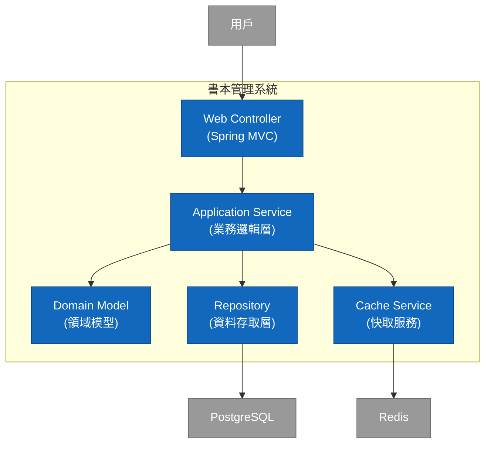

# demo-springboot-250613
包含 Redis OpenAPI 的範例

## 技術選型

| 決策項目 | 選擇 | 理由 |
|----------|------|------|
| 開發框架 | Spring Boot 3.5.0 | 成熟的企業級框架，豐富的生態系統 |
| Java 版本 | Java 21 | LTS 版本，效能優化，現代化語言特性 |
| 資料庫 | PostgreSQL | 關聯式資料庫，ACID 支援，JSON 支援 |
| 快取 | Redis | 高效能記憶體快取，豐富的資料結構 |
| API 文件 | OpenAPI 3.1 + Swagger UI | 標準化 API 規格，自動生成文件 |
| 建構工具 | Gradle | 靈活的建構配置，豐富的外掛生態 |

- Gradle 不用裝 使用 gradlew 就好.
- 如果有要用到 googld cloud sdk 要暫時先降到 Springboot 3.4.6, GCP 相關套件現在還在 3.5.0-M1.

## C4 Model - Container Diagram



## 建構塊視圖 (Building Block View)

### 架構層級

```
com.example.demo
├── DemoApplication.java          # 應用程式入口點
├── interfaces/                   # 介面層 (Presentation Layer)
│   ├── api/                     # 自動生成的 API 介面
│   └── dto/                     # 資料傳輸物件
├── applications/                 # 應用服務層 (Application Layer)
│   └── services/                # 業務邏輯服務
├── models/                      # 領域模型層 (Domain Layer)
│   ├── entities/                # 領域實體
│   └── valueobjects/            # 值物件
├── infrastructure/              # 基礎設施層 (Infrastructure Layer)
│   ├── repositories/            # 資料存取實作
│   ├── config/                  # 系統配置
│   └── cache/                   # 快取實作
└── config/                      # Spring 配置
```

## 環境配置

| 環境 | 描述 | 配置檔案 |
|------|------|----------|
| Local | 本機開發環境 | application-local.yml |
| Development | 開發測試環境 | application-dev.yml |
| Staging | 預發布環境 | application-staging.yml |
| Production | 正式環境 | application-prod.yml |

- src/main/resources/application.yml  
  將會打包到 docker image 中, 所以不要有機密資訊.

- config/application-local.yml  
  這個是 local (本機開發)的設定檔, 不會打包到 docker image 中, 但也不建議包含機密資訊, 你可以放在 config/application-local-env.yml 中.

##  開發指南

- openapi.yaml 有更動時需手動整理重新編譯，使用 `./gradlew clean openApiGenerate` 重新生成 API 介面
- 使用 `./gradlew bootRun --args='--spring.profiles.active=local'` 啟動本機環境
- Swagger UI 位置：http://localhost:8080/swagger-ui.html


## VSCode 設定

### 建立 launch.json

可以手動增加 `.vscode/launch.json` , 圖形化介面可從左邊的 Debug 選單新增配置，如下：  
作用是在透過 IDE 啟動 springboot 時可以指定 profile, 這樣就可以在 local 環境中使用 local 的設定檔.
``` json
{
    "version": "0.2.0",
    "configurations": [

        {
            "type": "java",
            "name": "Current File",
            "request": "launch",
            "mainClass": "${file}"
        },
        {
            "type": "java",
            "name": "DemoApplication",
            "request": "launch",
            "mainClass": "com.example.demo.DemoApplication",
            "projectName": "demo-springboot-250613",
            "env": {
                "spring.profiles.active": "local-env,local"
            }
        },
        {
            "type": "java",
            "name": "TestDemoApplication",
            "request": "launch",
            "mainClass": "com.example.demo.TestDemoApplication",
            "projectName": "demo-springboot-250613"
        }
    ]
}
```

## 從頭開始的話

[下載專案模板](https://start.spring.io/#!type=gradle-project&language=java&platformVersion=3.5.0&packaging=jar&jvmVersion=21&groupId=com.example&artifactId=demo&name=demo&description=Demo%20project%20for%20Spring%20Boot&packageName=com.example.demo&dependencies=lombok,devtools,configuration-processor,docker-compose,web,data-jpa,oauth2-resource-server,liquibase,postgresql,data-redis,validation,cache,actuator,sbom-cyclone-dx,otlp-metrics,testcontainers,distributed-tracing,prometheus)


