<a href="https://studio.firebase.google.com/import?url=https%3A%2F%2Fgithub.com%2Fsamzhu%2Fdemo-springboot-250613">
  
</a>

# Spring Boot 3 Modern Project Guide

## Project Overview

This guide will walk you through a project built with Java 21, Spring Boot 3, and Gradle. Our goal isn't just to write working code - we want to make sure the project is robust, fast, and easy to maintain in the future.

We'll start with basic setup, then explore database JPA, version control with Liquibase, and Redis caching. After that, we'll focus on "observability" - learning how to monitor your app's health using Micrometer and OpenTelemetry (OTLP), and send all monitoring data to Grafana for analysis.

This guide is perfect for developers who want to learn modern Spring Boot 3 practices.

## 🚀 Quick Start

### Start the Application

```bash
# Start with local development settings
./gradlew bootRun --args='--spring.profiles.active=local-env,local'
```

### Verify Everything Works

```bash
# Check application health
curl http://localhost:8080/actuator/health

# Test API - Add a book
curl --location 'http://localhost:8080/books' \
--header 'Content-Type: application/json' \
--data '{
    "title": "Test Book",
    "author": "Test Author",
    "isbn": "9780123456789",
    "price": 299.99
}'
```

Success response:

```json
{
    "id": 1,
    "title": "Test Book",
    "author": "Test Author",
    "isbn": "9780123456789",
    "publishYear": null,
    "price": 299.99,
    "createdAt": "2025-06-19T16:28:01.217281+08:00",
    "updatedAt": "2025-06-19T16:28:01.217292+08:00"
}
```

Failed response (duplicate book):

```json
{
    "type": "about:blank",
    "title": "Bad Request",
    "status": 400,
    "detail": "ISBN already exists",
    "instance": "/books"
}
```

Error messages follow RFC 9457 format. See [Spring Framework Reference](https://docs.spring.io/spring-framework/reference/web/webmvc/mvc-ann-rest-exceptions.html) for details.

View Swagger UI (API docs and test interface)
Open browser: http://localhost:8080/swagger-ui.html

View Grafana monitoring
Open browser: http://localhost:3000

### 📚 Suggested Learning Path (for beginners)

If you're new to these technologies, follow this order:

1. **Basic Features** (1-2 days)
   - Get the project running and test basic CRUD APIs
   - Understand Spring Boot's auto-configuration magic
   - Get familiar with Swagger UI

2. **Data Processing** (2-3 days)  
   - Learn how JPA works with databases
   - Understand how Liquibase manages database versions
   - Implement MapStruct object mapping

3. **Performance Optimization** (1-2 days)
   - Experience Redis caching benefits
   - See virtual thread performance improvements

4. **Monitoring & Observability** (3-4 days)
   - Learn to use Grafana to check system status
   - Understand what @Observed annotation does
   - Master distributed tracing concepts

5. **Deployment Practice** (2-3 days)
   - Try different environment configurations
   - Understand containerized deployment

**💡 Tip**: Don't rush to learn everything at once. Get the basics working first, then gradually dive into advanced features. Hands-on practice at each stage gives the best learning experience!

---

## Software Architecture

Here's how the project works:


- **WebController**: Receives user actions, like button clicks
- **AppService**: Handles main business logic, the system's core
- **Repository / CacheService**: Talks to database (PostgreSQL) and cache (Redis), handles data storage
- **DomainModel**: Defines system objects, like what properties a book should have

---

## 📁 Project Structure Overview

This project uses a common layered architecture. Different types of code go in different folders - like organizing clothes, pants, and socks separately. This makes finding and changing things much easier later.

```text
.
├── build.gradle                                         # Gradle build script, defines tools and packages needed
├── build/generated/openapi/                             # Auto-generated during compile time, no manual management needed
│   └── src/main/java/com/example/demo/
│       └── interfaces/                                  # Interface layer: All external system interaction code
│           ├── api/                                     # - (Auto-generated) API interfaces from openapi.yaml
│           └── dto/                                     # - (Auto-generated) Data transfer objects from openapi.yaml
├── config/                                              # Environment-specific config files, not packaged into final app
│   ├── application-local.yml                            # Settings for "local" environment (your computer)
│   ├── application-ut.yml                               # Settings for "ut" environment (unit tests)
│   ├── application-sit.yml                              # Settings for "sit" environment (integration tests)
│   └── application-prod-example.yml                     # Template for "prod" environment (passwords stored elsewhere)
├── compose.yaml                                         # Docker config - one click to set up all services locally
├── dev-resources/
│   └── openapi.yaml                                     # API specification file (single source of truth for all APIs)
└── src/
    ├── main/
    │   ├── java/com/example/demo/
    │   │   ├── applications/                            # Application layer (Service): Core business logic
    │   │   ├── config/                                  # Configuration layer: Various Spring configs
    │   │   ├── infrastructure/                          # Infrastructure layer: Database communication interfaces
    │   │   ├── interfaces/                              # Interface layer: All external system interaction code
    │   │   │   ├── mapper/                              # - Tools for converting between DTOs and database entities
    │   │   │   └── rest/                                # - API implementation code (Controllers)
    │   │   ├── models/                                  # Model layer: Database table definitions (JPA Entities)
    │   │   └── DemoApplication.java                     # Spring Boot application entry point
    │   └── resources/
    │       ├── application.yml                          # Basic, shared Spring Boot config
    │       ├── application-gcp.yml                      # Config for Google Cloud Platform (GCP)
    │       ├── application-aws.yml                      # Config for Amazon Web Services (AWS)
    │       └── db/changelog/                            # Liquibase database change scripts
    │           ├── db.changelog-master.yaml             # Main changelog file
    │           └── history/                             # All historical change records
    └── test/                                            # Test code
        └── java/com/example/demo/
            ├── TestDemoApplication.java
            ├── TestcontainersConfiguration.java         # Testcontainers config
            └── DemoApplicationTests.java                # Integration tests
```

---

## 🧩 Core Technologies & Key Dependencies

This project is built with a set of widely-used industry technologies.

### Languages/Frameworks

- **Java 21**: Latest long-term support version with new features like virtual threads
- **Spring Boot 3.5.x**: Latest enterprise Java framework with built-in monitoring and auto-configuration

### Build Tools & Plugins

These tools help us build and manage the project.

- **`org.springframework.boot`** Spring Boot's core tool. Makes it easy to start projects and package everything into a single runnable file.
- **`io.spring.dependency-management`** Spring's dependency management tool. It manages all package versions for us, so we don't need to specify each version manually.
- **`org.openapi.generator`** Core tool for "API First" approach. It reads `openapi.yaml` and automatically generates Java interfaces and data models (DTOs), keeping code and API docs always in sync.
- **`com.gorylenko.gradle-git-properties`** Generates a `git.properties` file with current Git version info (branch, commit). This way we always know which version is running in production.
- **`org.cyclonedx.bom`** Software Bill of Materials (SBOM) generator. It scans the project and lists all third-party packages used. Essential for checking known security vulnerabilities and license compliance.
- **`jacoco`** Code test coverage tool. Generates reports showing how complete our tests are.

### Key Dependencies

These are the core packages needed at runtime.

#### API & Web Layer

- **`spring-boot-starter-web`** Essential for building RESTful APIs. Includes embedded server (Tomcat) and Spring MVC framework.
- **`spring-boot-starter-validation`** Data validation tool. Lets us use annotations like `@NotNull`, `@Size` on DTOs to set data rules. Spring automatically checks incoming data when APIs receive requests.
- **`springdoc-openapi-starter-webmvc-ui`** Automatically generates interactive API documentation (Swagger UI). This webpage lets us test APIs directly in the browser based on our code and API specs.
- **`mapstruct`** and **`mapstruct-processor`** Object mapping tool. Automatically generates code to convert between DTOs and database entities, avoiding lots of repetitive get/set code.
- **`jackson-databind-nullable`** Helper package for handling the difference between `null` and "not provided (undefined)" in JSON. Especially useful for partial updates (PATCH) - lets us tell if a user intentionally set a field to `null` or just didn't touch it.

#### Data Access & Cache Layer

- **`spring-boot-starter-data-jpa`** Simplifies database operations. Makes CRUD (Create, Read, Update, Delete) operations easy.
- **`liquibase-core`** Database version control tool. Lets us manage database structure changes with files, like using Git for code. Ensures consistent database structure across all development environments.
- **`spring-boot-starter-cache`** Provides standard caching API. We can easily add caching with annotations like `@Cacheable` without worrying about the underlying cache technology.
- **`spring-boot-starter-data-redis`** Redis integration package. When used with `spring-boot-starter-cache`, Spring Boot automatically uses Redis as our cache storage.

#### Observability Layer

- **`spring-boot-starter-actuator`** Foundation of observability. Provides monitoring and management endpoints like `/actuator/health` for checking application health.
- **`spring-boot-starter-aop`** Enables `@Observed` annotation. Provides "Aspect-Oriented Programming" technology that lets monitoring tools automatically add metrics and tracing logic around our code.
- **`io.micrometer:micrometer-tracing-bridge-otel`** A bridge that translates Micrometer tracing commands into OpenTelemetry format.
- **`io.opentelemetry:opentelemetry-exporter-otlp`** An exporter that packages traces and logs into OTLP format and sends them to backend monitoring systems.
- **`io.opentelemetry.instrumentation:opentelemetry-spring-boot-starter`** OpenTelemetry auto-configuration tool. Simplifies integration complexity and automatically integrates OTel features (like sending logs) into Spring Boot projects.
- **`io.micrometer:micrometer-registry-otlp`** Metrics exporter. Converts Micrometer-collected metrics to OTLP format and sends them out.
- **`io.micrometer:micrometer-registry-prometheus`** Prometheus metrics endpoint. Provides another way to view metrics at `/actuator/prometheus`, creating a page for Prometheus systems to read. Very useful for local development.

---

## ⚙️ Environment Configuration & Settings Management

### Configuration File Loading Priority

Spring Boot loads configuration files in this priority:

1. **`application.yml`** - Base shared configuration
2. **`application-{profile}.yml`** - Environment-specific configuration (overrides base config)

During development, Spring also reads files in the `config/` folder, like `application-local.yml` designed for local development.

### Configuration File Architecture

Our configuration files use a layered design to handle different environments and deployment platforms properly.

#### Base Configuration Files (`src/main/resources/`)

These files are packaged into the Docker image, containing shared settings for all environments or platform-specific optimizations.

| File | Purpose | Description |
|------|---------|-------------|
| `application.yml` | Base shared settings | Basic configuration shared by all environments |
| `application-gcp.yml` | Google Cloud Platform | Enables GCP-specific service integrations |
| `application-aws.yml` | Amazon Web Services | Enables AWS-specific service integrations |

**GCP Environment Example**:

```yaml
# application-gcp.yml
spring:
  config:
    import: sm@  # Enable Google Secret Manager

management:
  endpoint:
    health:
      group:
        gcp:
          include: "db,pubsub,gcs,spanner"  # GCP service health checks
```

#### Environment-Specific Configuration (`config/`)

These files are **NOT** packaged into the Docker image - they must be mounted externally during deployment. This design follows the [12-Factor App Codebase](https://12factor.net/) principle, allowing the same code to run in different environments.

| File | Environment | Description | Key Features |
|------|-------------|-------------|--------------|
| `application-local.yml` | Local development | Developer machine settings | Detailed logs, SQL display, full monitoring |
| `application-sit.yml` | System integration test | SIT test environment | Full tracing, detailed logs, all endpoints open |
| `application-uat.yml` | User acceptance test | UAT test environment | Medium sampling, limited endpoints, near-production config |
| `application-prod-example.yml` | Production template | Production config reference | Low sampling, security config, performance optimization |

### Multi-Environment Startup Examples

#### Local Development

```bash
# Pure local environment
./gradlew bootRun --args='--spring.profiles.active=local'
```

#### Test Environments

```bash
# SIT environment (local or standalone server)
./gradlew bootRun --args='--spring.profiles.active=sit'

# SIT environment on GCP
./gradlew bootRun --args='--spring.profiles.active=sit,gcp'

# SIT environment on AWS
./gradlew bootRun --args='--spring.profiles.active=sit,aws'
```

### 🎯 Configuration Best Practices

#### Dynamic Version Injection

We use `@project.version@` to dynamically load the version from `build.gradle`:

```yaml
spring:
  application:
    version: '@project.version@' # Automatically replaced with actual version during compile
```

This ensures:

- ✅ Version stays consistent with build.gradle
- ✅ Avoids manual version update errors
- ✅ Monitoring systems can correctly track service versions

### Configuration Security Best Practices

#### 🔐 Handling Sensitive Information

**Never** put sensitive info (passwords, API keys, tokens) directly in config files. Recommended approaches:

1. **Environment Variables**:

   ```yaml
   spring:
     datasource:
       password: ${db.password}
   ```

2. **Cloud Secret Manager**:

   ```yaml
   # GCP
   db.password: ${sm@project_db_password}
   ```

#### 📊 Environment-Specific Tuning

Different environments should have different performance settings:

```yaml
# application-local.yml (development)
management:
  tracing:
    sampling:
      probability: 1.0  # 100% sampling for debugging

# application-prod.yml (production)
management:
  tracing:
    sampling:
      probability: 0.1  # 10% sampling to reduce performance impact
```

### VSCode Development Setup

We recommend creating `.vscode/launch.json` to simplify development. This file lets you start and debug Spring Boot applications directly in VSCode without typing long commands in the terminal.

#### Create via VSCode Command Palette (Recommended)

1. **Open Command Palette**: Use `Ctrl+Shift+P` (Windows/Linux) or `Cmd+Shift+P` (macOS)
2. **Search Command**: Type `Java: Run and Debug` and select it
3. **Select Main Class**: VSCode will scan the project, choose `com.example.demo.DemoApplication`
4. **Auto-generate Config**: This automatically creates `.vscode/launch.json` in the project root

```json
{
    "version": "0.2.0",
    "configurations": [
        {
            "type": "java",
            "name": "DemoApplication",
            "request": "launch",
            "mainClass": "com.example.demo.DemoApplication",
            "projectName": "demo-springboot-250613",
            "env": {
                "spring.profiles.active": "local-env,local"
            }
        }
    ]
}
```

---

## 🛠️ Development & Setup

### Development Guide

- When `openapi.yaml` changes, manually run `./gradlew clean openApiGenerate` to regenerate API code
- Use `./gradlew bootRun --args='--spring.profiles.active=local'` to start with `local` profile
- During local development, visit `http://localhost:8080/swagger-ui.html` to view and test APIs

### IDE Integration

For VSCode and other IDE development setup, see the detailed instructions in **⚙️ Environment Configuration & Settings Management** section above.

---

## 🤝 API First Development Workflow

This project follows **API First** development - "define API specs first, then write code".

We write all API details (like paths, parameters, response formats) in `openapi.yaml`. This file is our single, final standard - the **"Single Source of Truth"**. This ensures API documentation and actual code always stay in sync.

### How It Works

We use the `org.openapi.generator` Gradle tool for automation. When you compile the project, it:

1. **Reads Spec**: Reads the `dev-resources/openapi.yaml` file
2. **Generates Code**: Automatically generates corresponding Java interfaces and DTOs
3. **Includes in Build**: Treats generated code as part of the source code
4. **Developer Implementation**: Developers focus on business logic, implementing the generated interfaces

### Key Settings in build.gradle

Let's look at the `openApiGenerate` task configuration:

```groovy
tasks.named('openApiGenerate') {
    generatorName.set("spring")
    library.set("spring-cloud")
    inputSpec.set(layout.projectDirectory.file("dev-resources/openapi.yaml").asFile.path) // Where the API spec is
    outputDir.set(layout.buildDirectory.dir("generated/openapi").get().asFile.path)      // Where generated code goes
    apiPackage.set("com.example.demo.interfaces.api")   // Package for generated API interfaces
    modelPackage.set("com.example.demo.interfaces.dto") // Package for generated DTOs
    configOptions.set([
        hateoas: "false",
        interfaceOnly: "true",        // ✨ Generate interfaces only, not implementations
        useResponseEntity: "true",    // ✨ Use Spring's ResponseEntity<T> for API responses
        useSpringBoot3: "true",       // ✨ Ensure compatibility with Spring Boot 3
        useTags: "true",              // ✨ Group APIs by "tags" in YAML
        unhandledException: "true"    // ✨ Force developers to handle all possible errors
    ])
}
```

**Important Parameters Explained:**

- `interfaceOnly: "true"`
  - **Purpose**: Only generates Java `interface`, not actual `Controller` implementation classes
  - **Benefit**: Gives developers flexibility to implement business logic freely

- `useSpringBoot3: "true"`
  - **Purpose**: Ensures generated code is compatible with Spring Boot 3
  - **Impact**: Uses latest Jakarta EE specs instead of old `javax`

- `useTags: "true"`
  - **Purpose**: In `openapi.yaml`, you can add `tags` to APIs. This setting generates different API interface files based on tags
  - **Benefit**: Avoids cramming all APIs into one huge file, making code more maintainable

- `useResponseEntity: "true"`
  - **Purpose**: Makes API methods return Spring's `ResponseEntity<T>`
  - **Benefit**: Gives precise control over HTTP response codes (like 200, 201, 404) and headers

- `unhandledException: "true"`
  - **Purpose**: Adds `throws Exception` to generated interface methods
  - **Goal**: Forces developers to think about and handle possible errors

- `hateoas: "false"`
  - **Purpose**: Disables HATEOAS functionality (a style where API responses include related operation links, usually not needed for regular REST APIs)

The `interfaceOnly: "true"` setting is key - it generates only API "specifications" and data models, while Controller "implementations" are done by developers. This cleanly separates "API definition" from "business logic implementation".

### Benefits of API First

- **Contract as Documentation**: `openapi.yaml` itself is the most accurate, up-to-date API documentation
- **Enforced Consistency**: Since our `BookController` must implement the `BooksApi` interface, any spec-breaking changes fail at compile time
- **Parallel Development**: While backend developers build API features, frontend developers or other teams can use `openapi.yaml` to generate client stubs or mock servers for development and testing

---

## 🗺️ Object Mapping (MapStruct)

We use these two packages:

- `org.mapstruct:mapstruct`
- `org.mapstruct:mapstruct-processor`

### Purpose

In layered architecture, we don't want to pass database entities directly to frontend or external users. Instead, we create special Data Transfer Objects (DTOs).

MapStruct is a tool for "object conversion". It automatically generates code to convert between Entities and DTOs.

### Benefits

- **Great Performance**: It generates actual Java conversion code at compile time without reflection, so it's very fast
- **Type Safety**: If field names or types don't match during conversion, compilation fails, catching errors early
- **Less Boilerplate**: Developers just define a conversion interface, MapStruct generates all the get/set mapping code automatically

### Key Settings in build.gradle

```groovy
tasks.withType(JavaCompile) {
    options.compilerArgs = [
        // Tell MapStruct to generate converters as Spring Beans for easy injection
        '-Amapstruct.defaultComponentModel=spring',
        // Don't include timestamps in generated code, ensures identical builds
        '-Amapstruct.suppressGeneratorTimestamp=true',
        // Enable detailed logs during build for debugging
        '-Amapstruct.verbose=true',
        // Preserve method parameter names, crucial for Spring Cache to parse SpEL expressions (like #id)
        '-parameters'
    ]
}
```

### Mapper Interface Definition (`BookMapper.java`)

We define a `BookMapper` interface with `@Mapper` annotation to tell MapStruct it's a converter. With `componentModel = "spring"`, the generated `BookMapperImpl` class automatically gets `@Component` annotation, making it injectable as a Spring Bean.

```java
@Mapper(
    unmappedTargetPolicy = ReportingPolicy.IGNORE,  // Ignore unmapped properties in target object, avoid compile warnings
    nullValuePropertyMappingStrategy = NullValuePropertyMappingStrategy.IGNORE // When source property is null, don't update target property
)
public interface BookMapper {
    // Convert BookDto (DTO) to Book (Entity)
    Book toEntity(BookDto dto);

    // Convert Book (Entity) to BookDto (DTO)
    BookDto toDto(Book entity);
}
```

### Usage Example

```java
@RestController
@RequiredArgsConstructor // Lombok annotation, creates constructor for final fields with injection
public class BookController implements BooksApi {

    private final BookService bookService;
    private final BookMapper bookMapper; // ✨ MapStruct-generated converter injected here

    @Override
    public ResponseEntity<BookDto> booksPost(@Valid BookRequest bookRequest) {
        // Call mapper to convert frontend Request DTO to database Entity
        Book bookEntity = bookMapper.toEntity(bookRequest);

        Book createdBook = bookService.createBook(bookEntity);

        // Call mapper to convert database Entity to frontend Response DTO
        BookDto responseDto = bookMapper.toDto(createdBook);

        return ResponseEntity.status(HttpStatus.CREATED).body(responseDto);
    }
}
```

---

## 📜 Database Version Control (Liquibase)

In team development, managing database schema changes is a big challenge. If everyone randomly modifies their local database or relies on JPA's `ddl-auto: update`, it's easy to end up with different database structures, causing weird errors.

This project uses Liquibase to manage database structure changes like code. This ensures consistent and trackable database structures from development to testing to production.

### Why Not Use ddl-auto?

While `spring.jpa.hibernate.ddl-auto = update` is convenient in early development, it has serious problems:

- **No Precise Control**: You can't control exactly what SQL commands it generates
- **Possible Data Loss**: In some cases, it might misjudge and delete columns or tables
- **No Version History**: You have no idea when, who, or what changed the database
- **Not for Production**: Never use `update` in production environments

Liquibase solves these problems with a more rigorous process.

### How Liquibase Works

- **Automatic Execution**: When Spring Boot starts, it detects Liquibase and automatically runs database updates
- **Changelog**: Developers write all database modifications (like creating tables, adding columns) in "changelog" files. We use YAML format here
- **Tracking Tables**: Liquibase creates two management tables in your database: `DATABASECHANGELOG` and `DATABASECHANGELOGLOCK`
  - `DATABASECHANGELOGLOCK`: A lock ensuring only one application instance executes database changes at a time, avoiding conflicts
  - `DATABASECHANGELOG`: A record table. Every successfully executed change is recorded here. Each time the app starts, Liquibase compares the changelog file with this table, executing only new changes not yet recorded

### Project Implementation

#### Master Changelog

This is Liquibase's entry file at `src/main/resources/db/changelog/db.changelog-master.yaml`. It doesn't contain actual SQL changes but acts like a table of contents, referencing other change files.

```yaml
# db.changelog-master.yaml
databaseChangeLog:
  - include:
      file: history/20250614.yaml
      relativeToChangelogFile: true # Path relative to this master file
      description: Initialize tables
  # ✨ When you have new changes, add another include below
  # - include:
  #     file: history/20250615.yaml
  #     relativeToChangelogFile: true
  #     description: Add user table
```

#### Changeset Files

All actual database structure changes are defined in these files. We put them in the `history/` folder, named by date for easy tracking. One file can contain multiple `changeSet`s. Each `changeSet` is an independent, immutable database operation unit, uniquely identified by `id` and `author`.

Example `history/20250614.yaml`:

```yaml
# history/20250614.yaml
databaseChangeLog:
- changeSet:
    id: 1749857749130-1 # Unique ID, can be number, string, or auto-generated
    author: samzhu (generated)
    changes:
    - createTable:
        tableName: book
        remarks: Book table for storing book information
        columns:
        - column:
            name: id
            type: INTEGER
            autoIncrement: true
            constraints:
              primaryKey: true
              nullable: false
        - column:
            name: title
            type: VARCHAR(255)
            constraints:
              nullable: false
        #... other columns...
```

#### Development Workflow: How to Add a Database Change

Let's say you need to add a `stock_quantity` column to the `book` table.

1. **Create New File**: Create a new YAML file in `src/main/resources/db/changelog/history/`, like `20250616-add-stock-to-book.yaml`
2. **Define ChangeSet**: Write your change in the new file. Remember `id` must be unique
3. **Update Master File**: Go back to `db.changelog-master.yaml` and `include` the new file

    ```yaml
    databaseChangeLog:
      - include:
          file: history/20250614.yaml
          relativeToChangelogFile: true
          description: Initialize tables
      - include: # ✨ Add this section
          file: history/20250616-add-stock-to-book.yaml
          relativeToChangelogFile: true
          description: Add stock column to book
    ```

4. **Start Application**: Restart Spring Boot. Liquibase checks the `DATABASECHANGELOG` table, finds this new `changeSet` hasn't been executed, and runs the corresponding `ALTER TABLE` SQL command to add the new column

This process ensures every database change is recorded, trackable, and automatically applied consistently across all team members and environments.

---

## ⚡️ Caching Mechanism (Spring Cache + Redis)

To speed up application response times and reduce database load, we've implemented caching. For data that doesn't change often but is read frequently, caching can dramatically improve performance.

This project uses **Spring Cache** as the unified caching standard with **Redis** as the actual cache implementation.

### Spring Cache: Consistent Cache Abstraction

`spring-boot-starter-cache` provides a standard caching API. Its biggest benefit is letting our business logic code not worry about the underlying cache technology. Developers just need to learn a few standard annotations to add caching functionality.

- `@EnableCaching`: Used on configuration classes, the master switch to enable Spring Cache
- `@Cacheable`: Used on data reading methods. When this method is called, Spring first checks the cache. If data exists, it returns directly from cache without executing the method. If not, it executes the method, stores the result in cache, then returns it
- `@CacheEvict`: Used on data modification or deletion methods. When data changes, this annotation clears old data from cache to avoid users seeing stale content

### Redis: High-Performance Cache Implementation

We chose Redis as our cache server. Thanks to Spring Boot's powerful auto-configuration, integrating Redis is very simple:

1. Add `spring-boot-starter-data-redis` dependency in `build.gradle`
2. Configure Redis connection in `application.yml`

With just these two steps, Spring Boot automatically sets Redis as our default cache implementation.

### Cache Implementation

Let's look at the cache design in `BookService`.

#### Strategy: Only Cache High-Frequency Single Item Reads

In our project, we use a more precise caching strategy. We found that "get all books" (`getAllBooks()`) might return lots of data, and if any book changes, the entire list cache becomes invalid - not very efficient.

Therefore, our strategy is: **Only cache `getBookById(id)` - single item reads with high usage frequency**.

#### 1. Enable Caching

We enable caching in `CacheConfig.java` and define cache space names.

```java
// src/main/java/com/example/demo/config/CacheConfig.java
@Configuration
@EnableCaching // ✨ Master switch to enable caching
public class CacheConfig {
    /**
     * Define a cache space named "books"
     */
    public static final String BOOKS_CACHE = "books";
}
```

#### 2. Cache Single Book Reads

We only add `@Cacheable` annotation to the `getBookById` method. Note the `key` syntax - we use a little trick to create more meaningful keys.

```java
// src/main/java/com/example/demo/applications/BookService.java
@Service
public class BookService {
    //...

    /**
     * Get book by ID.
     * @Cacheable stores results in 'books' cache space,
     * using 'book_{id}' as key.
     */
    @Cacheable(cacheNames = CacheConfig.BOOKS_CACHE, key = "'book_' + #id")
    public Book getBookById(Integer id) {
        // ✨ This log only prints on cache miss
        log.info("Fetching book from database, ID: {}", id);
        return bookRepository.findById(id)
           .orElseThrow(() -> new ResponseStatusException(HttpStatus.NOT_FOUND, "Book not found"));
    }
}
```

`key = "'book_' + #id"`: This is a good practice. It adds a `book_` prefix to all book-related cache keys. When `id` is `123`, the Redis key becomes `book_123` instead of just `123`. This greatly improves readability and avoids confusion with other numeric ID caches (like `user_123`).

#### 3. Precise Single Cache Eviction

Since we don't cache the entire book list, when updating or deleting a book, we don't need to clear all book caches. We only need to precisely clear the cache for that specific modified or deleted book.

```java
// src/main/java/com/example/demo/applications/BookService.java
@Service
public class BookService {
    //...

    /**
     * Update book.
     * @CacheEvict only clears the specific 'book_{id}' entry in 'books' cache.
     */
    @Transactional
    @CacheEvict(cacheNames = CacheConfig.BOOKS_CACHE, key = "'book_' + #id")
    public Book updateBook(Integer id, Book book) {
        //...
    }

    /**
     * Delete book.
     * Similarly, only clears the deleted book's cache.
     */
    @Async
    @Transactional
    @CacheEvict(cacheNames = CacheConfig.BOOKS_CACHE, key = "'book_' + #id")
    public void deleteBook(Integer id) {
        //...
    }
}
```

`createBook` (add new book) method now doesn't need any `@CacheEvict` annotation. Adding a new book doesn't make any existing cached data "old" or "wrong".

#### 4. Critical Setting: Making `#id` Expression Work

When we use SpEL expressions like `key = "#id"` in `@Cacheable` or `@CacheEvict`, we're telling Spring: "Please use this method's `id` parameter as the cache key".

But how does Spring know which parameter is called `id`? By default, the Java compiler doesn't preserve method parameter names (like `id`, `book`) in compiled `.class` files to save space. This causes Spring Cache to fail when parsing `#id`, throwing errors.

To fix this, we must explicitly tell the compiler to preserve parameter names. Just add one setting in `build.gradle`:

```groovy
// build.gradle
tasks.withType(JavaCompile) {
    options.compilerArgs = [
        '-Amapstruct.defaultComponentModel=spring',
        '-Amapstruct.suppressGeneratorTimestamp=true',
        '-Amapstruct.verbose=true',
        '-parameters' // ✨ This is the key!
    ]
}
```

With the `-parameters` compiler flag, Spring Cache gets enough information to correctly parse `#id` as the `id` parameter value in `getBookById(Integer id)` method, making our dynamic cache keys work properly. This setting is shared by all tools in the project that depend on parameter names (including MapStruct).

#### Strategy Advantages

This "cache single items only" strategy is simpler and more efficient:

- **Simple Logic**: No more worrying about when to clear list caches
- **Performance Boost**: Directly helps the most common "get details by ID" scenario
- **Minimal Write Impact**: Updates or deletes have minimal cache impact, only affecting one key without touching other valid cached data

---

## 🚀 Hands-On: API Testing Examples

After successfully starting the project, you can use `curl` or any API testing tool (like Postman) to interact with the application. Here are two basic examples.

### 1. Add a Book (POST /books)

This command sends a POST request to `/books` endpoint to add a book.

**Command:**

```bash
curl --location 'http://localhost:8080/books' \
--header 'Content-Type: application/json' \
--data '{
    "title": "The Hobbit",
    "author": "J.R.R. Tolkien",
    "isbn": "9780345339686",
    "price": 15.99,
    "publishYear": 1937
}'
```

**Expected Response:**
If successful, the server returns `201 Created` status code and the created book data (including database-generated `id`).

```json
{
    "id": 1,
    "title": "The Hobbit",
    "author": "J.R.R. Tolkien",
    "isbn": "9780345339686",
    "price": 15.99,
    "publishYear": 1937
}
```

### 2. Query a Book (GET /books/{id})

This command sends a GET request to `/books/1` endpoint to query the book with `id` 1.

**Command:**

```bash
curl --location 'http://localhost:8080/books/1'
```

**Expected Response:**
The server returns `200 OK` status code and the corresponding book data.

```json
{
    "id": 1,
    "title": "The Hobbit",
    "author": "J.R.R. Tolkien",
    "isbn": "9780345339686",
    "price": 15.99,
    "publishYear": 1937
}
```

**Observe Cache Effect:**
Try running this query command twice in a row.

- **First Run**: In the application logs, you'll see something like `Fetching book from database, ID: 1`, indicating this query actually hit the database
- **Second Run**: This log won't appear. That's because the query result is already stored in Redis cache, and the application returns data directly from cache, greatly improving response speed. You can also clearly see the trace chain getting shorter in Grafana's Tempo tracing view.

--

## 🚀 Performance Boost: Java 21 Virtual Threads

This project enables a heavyweight new Java 21 feature: **Virtual Threads**.

### Traditional Thread Problems

In traditional Java applications, each Thread maps to an operating system thread. For network services that need lots of waiting (like waiting for database responses, external API responses), this wastes resources. When a thread is waiting, it's not doing work but still occupying a precious system thread slot, limiting the number of concurrent requests the system can handle.

### Virtual Thread Advantages

Virtual threads are ultra-lightweight threads managed by the JVM itself. Thousands of virtual threads can run on just a few traditional system threads. When a virtual thread needs to wait for I/O:

1. It doesn't block the underlying system thread
2. The JVM "pauses" it and lets that system thread run another virtual thread's task
3. When the I/O operation completes, the JVM "wakes up" the original virtual thread to continue

This mechanism can greatly increase application throughput, letting us handle more concurrent requests with less hardware.

### How to Enable?

In Spring Boot 3.2+, enabling virtual threads is very simple - just add one line to `application.yml`:

```yaml
spring:
  threads:
    virtual:
      enabled: true
```

This tells Spring Boot to use virtual threads to handle all incoming HTTP requests.

---

## 🔬 Modern Observability - Part 1: Spring's Implementation

"Observability" solves a core problem: when our application is running in production, how can we know what's happening inside? This helps us quickly find problems and optimize performance. This system is usually built on three pillars: **Metrics**, **Traces**, and **Logs**.

These are the "Three Pillars of Observability":

- **📊 Metrics**: Numerical values aggregated over time
  - How many people access my API per second?
  - What's the average response time?
  - How high is the error rate?
  
- **🔍 Traces**: The complete journey of a request from entering the system, through different services, to returning results
  - What steps did an API request go through?
  - How long did each step take?
  - Which step was slowest?
  
- **📝 Logs**: Records of individual events in the system
  - What happened at a specific time?
  - What's the detailed error message?
  - What did the user do?

### Spring's Modern Observability Philosophy

Before writing any monitoring code, we need to understand Spring Boot 3's observability philosophy. Micrometer's core developer Jonatan Ivanov said:

> "In these apps I don't create any Observations manually because basically everything that I would need is automatically instrumented…"

This reveals a core idea: **Rely on Automatic Instrumentation First**.

When we add `spring-boot-starter-actuator` and related packages to our project, the Spring Boot ecosystem automatically monitors lots of common operations for us, including:

- Incoming HTTP requests
- Outgoing RestTemplate requests
- Database JDBC queries
- Redis operations
- ...and more

This means without doing anything, we can see these infrastructure-level metrics and traces in the monitoring backend.

So when do we need to do it ourselves?
**Answer: When automatic instrumentation can't reach our custom core business logic that we want to observe deeply.**

For example, in our `BookService`, the `createBook` method includes multiple steps like "check ISBN, set timestamps, save to database". We want to monitor the entire `createBook` operation as a meaningful business unit. This is where the `@Observed` annotation comes in.

### `@Observed`: The Tool for Observing Core Business Logic

Micrometer is Spring's official observability facade, providing a standard API that lets our code focus on "what to observe" without worrying about technical details.

The `@Observed` annotation is the best practice for adding observability to our custom business logic. As Jonatan Ivanov said:

> "The idea... was that we want the users to instrument their code once using a single API and have multiple benefits out of it (e.g. metrics, tracing, logging)."

This is the core principle of `@Observed`: **"Instrument once, multiple benefits"**.

#### Why Not Use SDK or Java Agent Directly?

- **Compared to using OpenTelemetry SDK directly**: Using SDK directly requires lots of manual code to start/end traces, set attributes, etc. - tedious and error-prone. `@Observed` handles all this with a simple annotation.
- **Compared to using OpenTelemetry Java Agent**: Agent is effective for automatically monitoring known third-party packages (like database drivers), but it doesn't understand the business meaning of your custom methods (like `createBook`). `@Observed` lets you give this operation a meaningful name, making monitoring charts easier to understand.

`@Observed` strikes a great balance between "simple convenience" and "powerful functionality". It's more concise than direct SDK use, yet more flexible than Java Agent for monitoring custom business logic.

### `@Observed` Setup and Practice Guide

In Spring Boot 3, setting up `@Observed` is already very simple.

#### Step 1: Add Core Dependencies

In `build.gradle`, ensure these two key dependencies:

```groovy
// build.gradle
dependencies {
    // Provides foundation for Micrometer observability, cornerstone of all observability features
    implementation 'org.springframework.boot:spring-boot-starter-actuator'

    // Provides AOP (Aspect-Oriented Programming) capability, the technical foundation for @Observed
    implementation 'org.springframework.boot:spring-boot-starter-aop'
}
```

#### Step 2: Enable Global Switch

In `application.yml`, turn on annotation-based observability:

```yaml
# src/main/resources/application.yml
management:
  observations:
    annotations:
      enabled: true  # Master switch for @Observed functionality
```

#### Step 3: Configure Async Tracing (if your project uses it)

Since Spring Boot 3.2, the core component `ObservedAspect` needed by `@Observed` is auto-configured - you don't need to declare it manually.

Now, only when your project uses asynchronous operations like `@Async`, to ensure tracing information (like `traceId`) propagates correctly between threads, you need to create this configuration:

```java
// src/main/java/com/example/demo/config/ObservabilityConfig.java
@Configuration(proxyBeanMethods = false)
public class ObservabilityConfig {

    /**
     * To propagate tracing info in @Async threads,
     * we need to configure a TaskExecutor.
     * ContextPropagatingTaskDecorator automatically copies current thread's
     * tracing context (like traceId) to the new thread executing @Async tasks,
     * ensuring trace chain completeness.
     */
    @Bean
    public TaskExecutor taskExecutor() {
        ThreadPoolTaskExecutor executor = new ThreadPoolTaskExecutor();
        executor.setTaskDecorator(new ContextPropagatingTaskDecorator());
        return executor;
    }
}
```

**Note**: If your project doesn't use `@Async` at all, you don't even need to create the `ObservabilityConfig.java` file.

#### Step 4: Apply Annotation in Business Logic

In `BookService`, we use advanced `@Observed` features to add meaningful business names and custom tags to monitoring.

```java
// src/main/java/com/example/demo/applications/BookService.java
@Service
public class BookService {

    @Cacheable(cacheNames = CacheConfig.BOOKS_CACHE, key = "'book_' + #id")
    @Observed(
        name = "book.details.view",
        contextualName = "View Book Details",
        lowCardinalityKeyValues = {
            "operation", "get_by_id",
            "cache_enabled", "true"
        }
    )
    public Book getBookById(Integer id) {
        //... business logic...
    }

    @Transactional
    @CacheEvict(cacheNames = CacheConfig.BOOKS_CACHE, key = "'book_' + #id")
    @Observed(
        name = "book.inventory.update",
        contextualName = "Update Book Info",
        lowCardinalityKeyValues = {
            "operation", "update",
            "cache_evict", "single",
            "business_impact", "medium"
        }
    )
    public Book updateBook(Integer id, Book book) {
        //... business logic...
    }
}
```

`@Observed` annotation parameters explained:

- **`name`**: Metric name (`book.details.view`). We use "domain.subdomain.action" naming style for easier categorization and filtering in monitoring systems.
- **`contextualName`**: Trace Span name (`View Book Details`). We use plain business terms so even non-engineers can understand what each step means in trace charts.
- **`lowCardinalityKeyValues`**: Very useful feature. It lets us add custom Key-Value tags to metrics and traces.
  - **What is Low Cardinality?** "Cardinality" refers to the number of different possible values a tag can have. "Low cardinality" means the values are limited and predictable (e.g., `operation` can only be `create`, `update`, `delete`). We should only put low cardinality tags here.
  - **Never** put high cardinality values (like `book_id`, `user_id`) here - this causes monitoring system index explosion and performance problems.
  - **How to use**: Provide in `{ "key1", "value1", "key2", "value2" }` format.

### Advanced Tracing: Using Baggage to Inject High Cardinality Business Context (Optional)

We mentioned that `lowCardinalityKeyValues` **should not** store high cardinality data like `book_id` or `user_id`. So the question is: if I need to trace the complete request chain for a specific `book_id`, how do I do it?

The answer is using **Baggage**.

Baggage is a powerful concept in OpenTelemetry. Think of it as a "carry-on luggage" that travels with requests through the system. You can put a business ID (like `book-id: 123`) into this luggage at the request entry point (e.g., Controller), and this ID will automatically propagate through the entire call chain, even across multiple microservices.

This is an optional but extremely useful technique that can improve debugging and troubleshooting efficiency by an order of magnitude.

#### Step 1: Configure Baggage Fields in `application.yml`

First, we need to explicitly tell Micrometer Tracing which Baggage fields we want to track.

```yaml
# src/main/resources/application.yml
management:
  tracing:
    baggage:
      enabled: true # Ensure Baggage functionality is enabled
      remote-fields:
        - book-id # 1. Remote propagation: Lets 'book-id' propagate between microservices via HTTP headers
      tag-fields:
        - book-id # 2. Auto-tagging: Micrometer automatically adds this Baggage value as a Tag to all subsequent Spans. This is key to seeing it in Grafana
      correlation:
        enabled: true # 3. Log correlation
        fields:
          - book-id # 4. Also put 'book-id' value into log MDC for easy viewing and searching in logs
```

#### Step 2: Set Baggage Value in Controller

After configuration, we need to inject `Tracer` at the program entry point (`BookController`) and put the incoming `id` into Baggage.

```java
// src/main/java/com/example/demo/interfaces/rest/BookController.java

// ... other imports ...
import io.micrometer.tracing.Baggage;
import io.micrometer.tracing.Tracer;

@RestController
@RequiredArgsConstructor
public class BookController implements BooksApi {

    private final BookService bookService;
    private final BookMapper bookMapper;
    private final Tracer tracer; // Spring Boot auto-configures Tracer

    // ... other API methods ...

    @Override
    public ResponseEntity<BookDto> booksIdGet(Integer id) throws Exception {
        log.info("Getting book, ID: {}", id);
        // Put ID into Baggage at the beginning of request processing
        this.setBookIdInBaggage(id);
        Book book = bookService.getBookById(id);
        return ResponseEntity.ok(bookMapper.toDto(book));
    }

    // ... other methods needing ID do the same ...

    /**
     * Set book ID into distributed tracing Baggage.
     * @param bookId The book ID to set
     */
    private void setBookIdInBaggage(Integer bookId) {
        if (bookId == null) {
            return;
        }
        try {
            // Get BaggageField handle using name "book-id" configured in application.yml
            Baggage baggage = tracer.getBaggage("book-id");
            if (baggage!= null) {
                // Set Baggage value, effective in current tracing context
                baggage.makeCurrent(bookId.toString());
                log.info("Baggage 'book-id' set to: {}", baggage.get());
            } else {
                log.warn("Baggage field 'book-id' not configured or enabled.");
            }
        } catch (Exception e) {
            log.error("Error setting book-id to Baggage", e);
        }
    }
}
```

#### Step 3: Verify Results in Grafana Tempo

After completing setup and sending a request (e.g., `GET /books/2`), we can see amazing results in Grafana Tempo. In the trace waterfall chart, click on any Span, and you'll clearly see the `book-id` tag we just set in the `Span Attributes` section below.


With this feature, when customer service reports "Book page with ID 2 loads slowly", operations staff no longer need to search blindly. They can directly query in Tempo using something like `{ resource.service.name="demo", book-id="2" }` to immediately filter all request chains related to this book, precisely locating the problem source.

### From Technical Monitoring to Business Insights

Through this business-semantic monitoring approach, our monitoring data is no longer just cold technical metrics but can provide valuable business insights.

For example, we can now directly answer these questions in monitoring systems like Grafana:

- **Analyze Customer Behavior**:
      - `getAllBooks` marked as `book.catalog.browse`, we can count "How often do customers browse the product catalog?"
      - `getBookById` marked as `book.details.view`, we can analyze "How many book details do customers view on average?"
- **Evaluate Inventory Management Efficiency**:
      - By filtering `operation` tags (`create`, `update`, `remove`), we can create dashboards showing "Daily new books", "Update frequency", and "Product removals".
- **Quantify Business Impact**:
      - We defined `business_impact` tags for different operations (like `high`, `medium`). Now we can set smarter alerts, e.g., "Only send urgent alerts when operations with `business_impact` of `high` (like removing products) have error rates over 1%", letting teams focus on truly important issues.

In summary, this use of `@Observed` makes monitoring data valuable for the entire team (including product, operations, and management).

---

## 🔬 Modern Observability - Part 2: Working with OpenTelemetry

We've learned to use `@Observed` to add observability to business logic. Now let's unveil the mystery and see how these technology packages work together to convert monitoring data to OpenTelemetry format and send it out.

### Overall Architecture Diagram

```mermaid
graph TD
    subgraph "Runtime Environment"
        User[👨‍💻 User]
        App
        DB
        Cache
    end

    subgraph "Inside otel-lgtm"
        Developer[👨‍💻 Developer]
        Grafana[📊 Grafana]
        Tempo
        Mimir[📉 Mimir - Metrics]
        Loki[📜 Loki - Logs]
        Collector
    end

    User -->|HTTP API Request| App
    App -->|JDBC| DB
    App -->|Redis Commands| Cache
    App -->|OTLP - gRPC/HTTP| Collector
    Collector --> Tempo
    Collector --> Mimir
    Collector --> Loki
    Grafana -->|Query| Tempo
    Grafana -->|Query| Mimir
    Grafana -->|Query| Loki
    Developer -->|Browse| Grafana
```



### Layered Architecture: Decoupling and Collaboration

To understand these package relationships, the key is grasping Spring Boot 3's observability layered architecture:

1. **Instrumentation Layer**: Where we developers interact, mainly using `@Observed`
2. **Facade Layer**: Provided by Micrometer. It defines a neutral, standard API
3. **Implementation Layer**: Handled by OpenTelemetry. It's the actual engine behind Micrometer API
4. **Export Layer**: Composed of various Exporters, responsible for packaging monitoring data into OTLP format and sending to backend systems

### Key Package Responsibilities and Data Flow

The diagram below clearly shows how metrics, traces, and logs are processed through different paths when a method with `@Observed` is called.


| Package (Dependency)                                                     | Purpose | Description |
| ------------------------------------------------------------------------ | :--- | :--- |
| **`spring-boot-starter-actuator`** | Framework Foundation | Cornerstone of observability. It brings in Micrometer and provides `/actuator` endpoints. |
| **`spring-boot-starter-aop`** | Powers `@Observed` | Provides AOP technology that lets `@Observed` annotation be intercepted and automatically add monitoring logic. |
| **`io.micrometer:micrometer-tracing-bridge-otel`** | API Bridge | Acts as translator, converting Micrometer tracing commands into OpenTelemetry-understandable commands. |
| **`io.opentelemetry.instrumentation:opentelemetry-spring-boot-starter`** | Auto-configuration Package | Greatly simplifies integration, automatically completes OpenTelemetry initialization and setup behind the scenes. |
| **`io.opentelemetry:opentelemetry-exporter-otlp`** | Trace & Log Exporter | Responsible for packaging generated traces and logs into OTLP format and sending over network. |
| **`micrometer-registry-otlp`** | Metrics Exporter | Clear responsibility: converts Micrometer-collected metrics to OTLP format and pushes to backend. |
| **`micrometer-registry-prometheus`** | Metrics Local Endpoint | Provides another way to view metrics. It opens an HTTP endpoint at `/actuator/prometheus`, convenient for direct metric viewing during development and debugging. |

Simply put, our application monitors through unified Micrometer API (`@Observed`), implemented by OpenTelemetry behind the scenes, with specialized exporters sending data in OTLP format to the backend. All this complex assembly work is automated by Spring Boot, creating a clear, maintainable observability system.

### Runtime View

#### Journey of an API Request

Let's see what happens internally when an "add book" request (`POST /books`) comes in.


---

## 🔬 Modern Observability - Part 3: Exploring Telemetry Data in Grafana

Now comes the most exciting part: actually seeing the telemetry data we've worked hard to collect. Open your browser and visit `http://localhost:3000` to enter Grafana's dashboard.

### Grafana Navigation and Data Sources

In Grafana's left navigation bar, click "Explore" (compass icon). In the dropdown menu at the top of the page, you'll see that the `otel-lgtm` Docker image has pre-configured three core data sources for us, corresponding to the three pillars of observability:

- **`mimir`**: For querying **Metrics**
- **`loki`**: For querying **Logs**
- **`tempo`**: For querying **Traces**

### The Art of Tracing: Using Tempo and TraceQL

On Grafana's Explore page, select the `tempo` data source. We can use TraceQL language to query traces.

1. **Query by Service Name**:
    In `application.yml`, we defined `spring.application.name: demo`. This name becomes `service.name` in OpenTelemetry. Therefore, the most common query is filtering all traces from our application.

    ```text
    {resource.service.name="demo"}
    ```

    

2. **Query by Custom Span Name**:
    We used `@Observed(contextualName = "View Book Details")` in `BookService` to give methods meaningful names. This name becomes the Span name, letting us precisely find traces of specific business logic.

    ```text
    {name="View Book Details"}
    ```

    

3. **Analyze Trace View (Waterfall View)**:
    Click any query result to see a waterfall chart.
    - **Cache Miss**: When you first query a book's details, you'll see a hierarchical structure: top level is `GET /books/{id}`, below is `View Book Details`, and further below are `SELECT` database query Spans. Each Span's duration is clearly visible.
    - **Cache Hit**: When you query the same book again, the `SELECT` Span disappears and total trace duration significantly shortens. This directly proves cache effectiveness.

### The Power of Metrics: Using Mimir and PromQL

In the new version, although the underlying metric storage technology is Mimir, it provides a fully Prometheus-compatible query endpoint. Therefore, the data source is directly named `prometheus`, letting users focus on using standard PromQL (Prometheus Query Language) for queries - the most widely used metric query language in the industry.

#### OTLP to Prometheus Name Conversion

Understanding a key conversion rule is crucial: Micrometer-generated metric names are converted when exported to Mimir/Prometheus via OTLP.

- Dots `.` in metric names are converted to underscores `_`
- The `service.name` (`demo`) resource attribute is mapped to the `job` label
- Timers (`@Observed` or HTTP requests) automatically generate metrics in `_milliseconds` units with suffixes like `_count`, `_sum`, `_bucket` (histogram buckets). This is because newer Micrometer versions default to milliseconds for higher precision.

| Original Name (`@Observed` name) | Converted PromQL Metric (example) |
| :--- | :--- |
| `book.details.view` | `book_details_view_milliseconds_count`, `book_details_view_milliseconds_sum` |
| HTTP Server Requests | `http_server_requests_milliseconds_count` |

#### Useful PromQL Queries

1. **Query API Requests Per Second (RPS)**:

    ```promql
    rate(http_server_requests_milliseconds_count{job="demo"}[5m])
    ```

    This query calculates the average requests per second for the `demo` service over the past 5-minute window.

    

2. **Query "View Book Details" P95 Latency (in milliseconds)**:

    ```promql
    histogram_quantile(0.95, sum(rate(book_details_view_milliseconds_bucket{job="demo"}[5m])) by (le))
    ```

    This is an advanced query using histogram (`_bucket`) data to calculate the 95th percentile latency for "View Book Details" operations in milliseconds.

3. **Analyze with Custom Tags**:
    We defined `lowCardinalityKeyValues` in `@Observed`, like `operation="get_by_id"`. This tag enables more detailed analysis.

    ```promql
    // Calculate total count of all "get_by_id" operations in the past 5 minutes
    sum(increase(book_details_view_milliseconds_count{job="demo", operation="get_by_id"}[5m]))
    ```

#### The Magic of Exemplars

In Grafana's chart panels, if you see a colored diamond icon next to a data point, that's an **Exemplar**. It's a **specific trace sample** associated with that time point's metric data. When you see a spike in the latency chart, you can click the diamond icon on that spike, and Grafana will immediately take you to **the complete trace view of the request that caused this latency spike**. This feature dramatically shortens the path from "finding problems" to "locating problems".

### Log Correlation: Using Loki and LogQL

Finally, select the `loki` data source. We use LogQL to query logs.

To enable logs to be successfully collected and parsed by the backend `otel-lgtm`, you need to **enable Spring Boot's file logging and set its format to `logstash` JSON**. This ensures all file-written logs have the structured format that Loki loves. You can achieve this by adding configuration like this in `application.yml`:

```yaml
logging:
  structured:
    format:
      file: logstash     # Set file log format to logstash (JSON)
```

After configuration, thanks to OpenTelemetry's automatic integration, key tracing information like `trace_id` and `span_id` is automatically added to JSON logs, making log-trace correlation incredibly powerful.

1. **Query All Application Logs**:
    The `spring.application.name` defined in `application.yml` is automatically mapped to the `service_name` label in Loki. This is the most direct way to filter specific application logs.

    ```logql
    {service_name="demo"}
    ```

    

2. **Trace to Logs**:
    This is the most commonly used feature. Since `trace_id` is already included in our JSON logs, the log agent in `otel-lgtm` intelligently extracts it as an indexable label. Therefore, in Tempo's trace waterfall chart, click any Span, then click the "Logs for this span" button, and Grafana can still precisely filter all related logs.

3. **Manually Query Logs by Trace ID**:
    You can also copy a `trace_id` from Tempo and directly use this label to query in Loki, which is more efficient than parsing full text.

    ```logql
    {service_name="demo", trace_id="copied_trace_id"}
    ```

    If you want to further process log JSON content (e.g., only show the `message` field), you can add `json` and `line_format` filters:

    ```logql
    {service_name="demo", trace_id="copied_trace_id"} | json | line_format "{{.message}}"
    ```

---

## 🔬 Modern Observability - Part 4: Full-Stack Tracing with Grafana Faro Integration (Optional)

In modern web applications, monitoring only backend services isn't enough. Complete observability needs to cover the full chain from user browser to backend database. This project demonstrates how to use **Grafana Faro** for frontend observability and seamlessly integrate with backend OpenTelemetry tracing.

### Grafana Faro Integration Implementation

#### Frontend Tracing Configuration (`src/main/resources/static/index.html`)

We've integrated Grafana Faro in the frontend page for complete frontend observability:

```html
<!-- Load Grafana Faro CDN packages -->
<script src="https://cdn.jsdelivr.net/npm/@grafana/faro-web-sdk@^1/dist/bundle/faro-web-sdk.iife.js"></script>
<script src="https://cdn.jsdelivr.net/npm/@grafana/faro-web-tracing@^1/dist/bundle/faro-web-tracing.iife.js"></script>
<script src="https://cdn.jsdelivr.net/npm/@grafana/faro-transport-otlp-http@^1/dist/bundle/faro-transport-otlp-http.iife.js"></script>

<script>
document.addEventListener('DOMContentLoaded', () => {
    const { initializeFaro, getWebInstrumentations } = window.GrafanaFaroWebSdk;
    const { TracingInstrumentation } = window.GrafanaFaroWebTracing;
    const { OtlpHttpTransport } = window.GrafanaFaroTransportOtlpHttp;

    const faro = initializeFaro({
        // Application identification
        app: {
            name: 'my-app-frontend',
            version: '1.0.0',
            environment: 'development'
        },

        // Explicitly set OpenTelemetry resource attributes
        otelResourceAttributes: {
            'service.name': 'my-app-frontend',
            'service.version': '1.0.0',
            'deployment.environment': 'development'
        },

        // Auto-instrumentation configuration
        instrumentations: [
            ...getWebInstrumentations(),      // Basic Web instrumentations
            new TracingInstrumentation()      // Tracing instrumentation (auto-injects traceparent to fetch)
        ],

        // OTLP transport configuration
        transports: [
            new OtlpHttpTransport({
                tracesURL: 'http://localhost:4318/v1/traces',
                logsURL: 'http://localhost:4318/v1/logs',
                bufferSize: 100,
                concurrency: 5,
            })
        ],

        debug: true,
    });

    // Test sending initial event
    faro.api.pushEvent('page_loaded', { timestamp: Date.now() });
});
</script>
```

#### Automatic Frontend-Backend Trace Correlation

When a user clicks the "Get Books" button, Faro's `TracingInstrumentation` automatically:

1. **Creates Frontend Span**: Records user action and API request
2. **Injects traceparent Header**: Automatically adds tracing context to `fetch('/books')` request
3. **Correlates Backend Trace**: Spring Boot receives the traceparent header and creates correlated backend Span

```javascript
// Actual event handling logic
getBooksButton.addEventListener('click', () => {
    // Manually send custom event
    if (window.faro && window.faro.api) {
        window.faro.api.pushEvent('button_clicked', { action: 'get_books' });
    }
    
    // Fetch API is automatically traced by TracingInstrumentation
    fetch('/books')
      .then(response => {
          // Handle response...
          if (window.faro && window.faro.api) {
              window.faro.api.pushEvent('books_fetched', { count: data.length });
          }
      })
      .catch(error => {
          // Automatic error tracking
          if (window.faro && window.faro.api) {
              window.faro.api.pushError(error);
          }
      });
});
```

### Full-Stack Trace Effect in Tempo

After integrating Grafana Faro, you can see complete frontend-backend trace chains in Tempo:


As shown, you can now query in Tempo:

- **Frontend Service** (`my-app-frontend`): User interactions, page loads, API requests
- **Backend Service** (`demo`): API processing, business logic, database operations
- **Complete Chain**: End-to-end tracing from user click to database query

### Useful Full-Stack Trace Queries

#### 1. Query Frontend Traces

```traceql
{resource.service.name="my-app-frontend"}
```

#### 2. Query Backend Traces

```traceql
{resource.service.name="demo"}
```

#### 3. Query Complete Frontend-Backend Chains

```traceql
{resource.service.name="my-app-frontend" || resource.service.name="demo"}
```

#### 4. Analyze Cross-Service Performance

```traceql
{(resource.service.name="my-app-frontend" || resource.service.name="demo") && duration>1s}
```

#### 5. Trace Specific Business Operations

```traceql
{resource.service.name="demo" && name="View Book Details"}
```

### Faro Integration Advantages

1. **Zero-Config Auto-Correlation**: Frontend and backend traces automatically correlate via `traceparent` header
2. **Complete User Experience**: Full view from browser click to database query
3. **Unified Monitoring Platform**: Frontend and backend data converge to the same Grafana/Tempo platform
4. **Rich Context**: Complete context combining frontend user behavior and backend business logic

### Real-World Application Scenarios

- **User Experience Analysis**: Analyze complete timeline from user click to page update
- **Performance Bottleneck Location**: Quickly determine if slow requests are frontend or backend issues
- **Error Root Cause Analysis**: Trace complete error propagation chain from frontend to backend
- **Business Process Monitoring**: Monitor critical business process execution across frontend and backend

Through Grafana Faro integration, we achieve true full-stack observability, providing a complete monitoring solution for modern web applications.

---

## Environment and Configuration

### Containerized Environment (`compose.yaml`)

We use Docker Compose to start all required external services with one click, including `postgres` (database), `redis` (cache), and `otel-lgtm` (monitoring backend). This lets any developer quickly set up a complete development and testing environment on their machine.

### Application Configuration (`application.yml`)

This is the project's control center, defining various application behaviors. By now, you should better understand how each setting corresponds to the technologies discussed in previous sections:

- **`spring.application.name: demo`**: Very important. This name becomes `service.name` in OpenTelemetry, your basis for filtering services in Grafana.
- **`spring.threads.virtual.enabled: true`**: Enable Java 21 virtual threads for improved throughput. See 🚀 Performance Boost section.
- **`management.observations.annotations.enabled: true`**: Master switch for `@Observed` annotations. See 🔬 Observability section.
- **`management.opentelemetry.resource-attributes`**: Adds extra tags to all outgoing monitoring data, like service version and deployment environment, for easier backend filtering.
- **`management.tracing.sampling.probability: 1.0`**: Sampling rate set to `1.0` (100%). Useful for development and testing to ensure every request trace is recorded. In production, usually set lower (e.g., `0.1`) for performance and cost considerations.
- **`management.otlp.*.endpoint`**: Explicitly specifies where to send Metrics, Traces, and Logs. Here we point to `otel-lgtm` container's port 4318.
- **`spring.jpa.hibernate.ddl-auto`** (not set to `update` or `create`): We give database structure management completely to Liquibase for rigorous version control.

---

## Monitoring

```bash
curl -X GET http://localhost:8080/actuator/health
```

```json
{
    "status": "UP",
    "groups": [
        "liveness",
        "readiness"
    ]
}
```

Readiness Probe

```bash
curl -X GET http://localhost:8080/actuator/health/readiness
```

```json
{
    "status": "UP"
}
```

Liveness Probe

```bash
curl -X GET http://localhost:8080/actuator/health/liveness
```

```json
{
    "status": "UP"
}
```

SBOM Information

```bash
curl -X GET http://localhost:8080/actuator/sbom/application
```

```json
{
    "bomFormat": "CycloneDX",
    "specVersion": "1.6",
    "serialNumber": "urn:uuid:9993dfa5-8a64-4d53-a404-c1a56a0be1cb",
    "version": 1,
    "metadata": {
        "timestamp": "2025-06-17T06:58:29Z",
        "tools": {
            "components": [
                {
                    "type": "application",
                    "author": "CycloneDX",
                    "name": "cyclonedx-gradle-plugin",
                    "version": "2.3.0"
                }
            ],
            "services": []
        },
        "component": {
            "type": "application",
            "bom-ref": "pkg:maven/com.example/demo@0.0.1?project_path=%3A",
            "group": "com.example",
            "name": "demo",
            "version": "0.0.1",
            "purl": "pkg:maven/com.example/demo@0.0.1?project_path=%3A",
            "modified": false,
            "externalReferences": []
        },
        "licenses": []
    },
    "components": [
        {
            "type": "library",
            "bom-ref": "pkg:maven/org.springframework.boot/spring-boot@3.5.0?type=jar",
            "publisher": "VMware, Inc.",
            "group": "org.springframework.boot",
            "name": "spring-boot",
            "version": "3.5.0",
            "description": "Spring Boot",
            "hashes": [
                {
                    "alg": "MD5",
                    "content": "bda13182d51c044ec0ce7c4c62a2cc68"
                }
            ],
            "licenses": [
                {
                    "license": {
                        "id": "Apache-2.0"
                    }
                }
            ],
            "purl": "pkg:maven/org.springframework.boot/spring-boot@3.5.0?type=jar",
            "modified": false,
            "externalReferences": [
                {
                    "type": "website",
                    "url": "https://spring.io"
                }
            ],
            "properties": [
                {
                    "name": "cdx:maven:package:test",
                    "value": "false"
                }
            ]
        },
        {
            "type": "library",
            "bom-ref": "pkg:maven/org.springframework.data/spring-data-commons@3.5.0?type=jar",
            "group": "org.springframework.data",
            "name": "spring-data-commons",
            "version": "3.5.0",
            "description": "Core Spring concepts underpinning every Spring Data module.",
            "hashes": [
                {
                    "alg": "MD5",
                    "content": "a753695738fbd37e798a738072592550"
                }
            ],
            "licenses": [
                {
                    "license": {
                        "id": "Apache-2.0"
                    }
                }
            ],
            "purl": "pkg:maven/org.springframework.data/spring-data-commons@3.5.0?type=jar",
            "modified": false,
            "externalReferences": [
                {
                    "type": "issue-tracker",
                    "url": "https://github.com/spring-projects/spring-data-commons/issues"
                }
            ],
            "properties": [
                {
                    "name": "cdx:maven:package:test",
                    "value": "false"
                }
            ]
        }
    ]
}
```

Git Information

```bash
curl -X GET http://localhost:8080/actuator/info
```

```json
{
    "git": {
        "branch": "main",
        "commit": {
            "id": "66fb93d",
            "time": "2025-06-19T02:27:31Z"
        }
    }
}
```

### VS Code Extension Recommendations

- [vscjava.vscode-java-pack](https://marketplace.visualstudio.com/items?itemName=vscjava.vscode-java-pack)
- [vmware.vscode-boot-dev-pack](https://marketplace.visualstudio.com/items?itemName=vmware.vscode-boot-dev-pack)
- Docker

## 📋 Best Practices Checklist

### Development Phase

- [ ] Run `./gradlew clean openApiGenerate` after modifying `openapi.yaml`
- [ ] Set appropriate TTL when adding cache
- [ ] Add `@Observed` annotation to important business logic

### Deployment Phase

- [ ] Use different configuration files for different environments
- [ ] Use environment variables or Secret Manager for sensitive information
- [ ] Set appropriate trace sampling rate (0.1 recommended for production)

## 📚 Further Learning Resources

### Official Documentation

- [Spring Boot Official Documentation](https://docs.spring.io/spring-boot/docs/current/reference/htmlsingle/)
- [OpenTelemetry Documentation](https://opentelemetry.io/docs/)
- [Grafana Documentation](https://grafana.com/docs/)

## Summary

This guide demonstrates how to integrate a series of modern tools and practices to build a Spring Boot project that's not just feature-complete but also considers performance, maintainability, and observability.

For developers, evolving from "getting features done" to "doing quality work" requires consciously adopting these modern practices:

- Embrace Java 21 virtual threads for simpler code and higher system throughput
- Use Liquibase for database version control to ensure team collaboration and multi-environment deployment consistency
- Practice API-First development workflow to establish clear service contracts and accelerate team parallel development
- Leverage tools like MapStruct and Spring Cache to eliminate repetitive boilerplate code and effectively improve application performance
- Build comprehensive observability system through Micrometer and OpenTelemetry to deeply understand system internal behavior, transforming passive "debugging" into proactive "performance optimization" and "problem prevention"

**Remember: Good programs don't just run - they run stably, run fast, and problems can be quickly located when they occur!**

Incorporating these practices into daily development helps improve final product quality and development team productivity. Hope this guide provides useful reference for your next project.

---

*If this guide helped you, feel free to share with other developers. Questions or suggestions? Welcome to raise Issues or Pull Requests!* 🙌